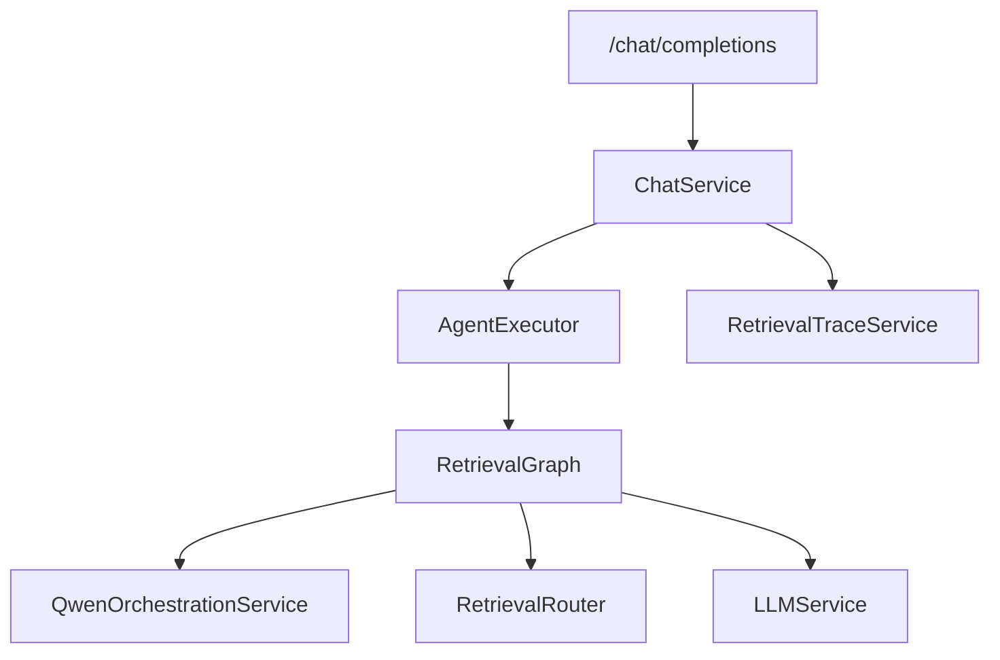

# LangGraph Module

## 功能

`app/langgraph` 是在线检索问答编排层，负责把 `/chat/completions` 的内部执行链路升级为权限计算、Qwen 意图识别、查询拆解、多路检索、证据判断和最终回答。

当前实现保持前端接口兼容：如果运行环境已安装 `langgraph`，优先编译真实 LangGraph；如果依赖暂不可用，则使用同样节点顺序的顺序执行器，保证接口可用。

## 调用关系

## 输入

- `question`：用户问题。
- `mode`：问答模式，例如 `auto/base_only/project_only/hybrid`。
- `project_id`：项目上下文，可为空。
- `current_user`：当前登录用户，用于权限过滤。

## 输出

- `answer`：最终回答。
- `evidences`：统一 Evidence 列表，包含 `project_id/document_id/drawing_no/page_no/chunk_id`。
- `raw`：意图、子查询、召回耗时、重排结果和证据判断，用于审计 trace。

## 自检

- 编排层不直接操作数据库，检索由 `RetrievalRouter` 和各 Retriever 完成。
- 所有回答证据必须保留来源字段，禁止生成不可追溯答案。
- LangGraph 编译失败会记录 `logger.exception()`，并降级到兼容执行器。

## Agentic Retrieval Planner

当前 LangGraph 节点顺序为：意图识别、查询拆解、Retrieval Planner、计划检索执行、合并去重、Reranker、证据判断、回答生成。Planner 输出会写入 `state.retrieval_plan`、`raw.retrieval_plan` 和 `trace_steps[*].details.retrieval_plan`。

`trace_steps` 与旧字段 `agent_trace` 同源，前端可优先读取 `trace_steps` 展示每个节点的 `planned_retrievers`、`executed_retrievers`、`fallback_used`、`retriever_hits` 和耗时。
