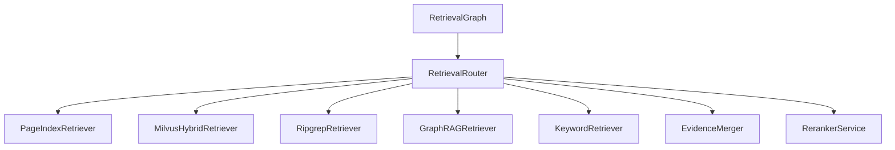

# Retrieval Module

## 功能

`app/retrieval` 是统一检索层，负责把 PageIndex、Milvus、ripgrep、GraphRAG 和关键字召回合并成统一 Evidence，再交给 Reranker 重排。

检索器只负责召回，权限、审核状态和版本状态必须通过 MySQL 二次校验，避免向量库或文本镜像绕过项目隔离。

## 调用关系

## 输入

- `query`：检索查询。
- `mode`：检索范围。
- `project_id`：项目上下文。
- `user`：当前用户，用于项目隔离。
- `limit`：返回证据数量。

## 输出

统一 Evidence 字段：

`source_type / project_id / knowledge_base_id / document_id / drawing_no / page_no / chunk_id / content / score / metadata`

## 自检

- `RipgrepRetriever` 必须使用参数数组和 `shell=False`，禁止拼接 shell 命令。
- Milvus、ripgrep 和 GraphRAG 召回后必须映射回 MySQL 文档、页和 Chunk。
- Reranker 结果保留 `last_details`，用于写入 `retrieval_traces`。

## Agentic Retrieval Planner

在线问答默认不再执行全部检索器。LangGraph 会先调用 Retrieval Planner 生成 `selected_retrievers`，再由 `RetrievalRouter.execute_planned()` 只执行计划中的检索器。若某个子查询的规划检索器全部 0 命中，Router 会按计划中的 `fallback_retrievers` 补充执行 `keyword`。

`RetrievalRouter.search()` 默认使用 Planner；`RetrievalRouter.search_all()` 仅供 `/retrieval/debug` 显式传入 `execution_mode=all` 时使用。`used_retrievers` 表示实际执行过的检索器，`planned_retrievers` 表示 Planner 原始选择。
