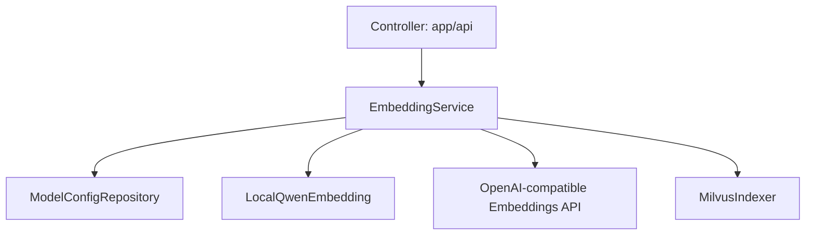

# Services Module

## 功能

`app/services` 是后端业务服务层，承接 Controller 传入的请求，统一编排 Repository、外部模型服务、对象存储、向量库和业务校验逻辑。

当前 Embedding 相关服务包括：

- `EmbeddingService`：统一 Embedding 入口，根据配置选择本地真实模型或远程 OpenAI-compatible 接口。
- `LocalQwenEmbedding`：加载本地 `Qwen3-Embedding-0.6B`，生成固定维度向量。
- `ModelService`：管理 LLM、Embedding、Reranker 等模型配置，并触发连通性测试。

## 调用关系



## 输入

本地 Embedding 推荐配置：

```env
EMBEDDING_PROVIDER=local
EMBEDDING_MODEL=E:\workspace\botree-agent\backend\workspace\Qwen\Qwen3-Embedding-0.6B
EMBEDDING_DEVICE=cuda
EMBEDDING_BATCH_SIZE=8
EMBEDDING_DIM=1024
```

## 输出

`EmbeddingService.embed_texts()` 返回 `list[list[float]]`，向量数量与输入文本数量一致，每条向量长度必须等于 `EMBEDDING_DIM`。

## 后端改造新增服务

| 服务 | 职责 |
| --- | --- |
| `PageIndexService` | 将 MinerU 解析结果归一化为文档页、页内块和 PageIndex，并生成 ripgrep 可检索的文本镜像。 |
| `IndexPipelineService` | 统一编排 PageIndex、Milvus、ripgrep 文本镜像和 MySQL GraphRAG 索引构建。 |
| `IndexTaskService` | 创建 `index_tasks` 记录，并把离线构建/发布任务投递给 RQ；Redis 未启用时同步降级执行。 |
| `GraphIndexService` | 基于 Chunk 构建第一阶段 MySQL GraphRAG 实体和关系，保留来源追踪。 |
| `QwenOrchestrationService` | 为 LangGraph 提供意图识别、查询拆解和证据充分性判断的服务入口。 |
| `RerankerService` | 对 PageIndex、Milvus、ripgrep、GraphRAG 多路 Evidence 做统一重排。 |
| `RetrievalTraceService` | 将在线问答的 intent、sub_queries、retriever hits、rerank 和 citations 写入审计表。 |

新增服务仍遵循 Controller -> Service -> Repository -> Database 分层，API 层只调用 Service，不直接操作 ORM 查询。

## 示例

```python
from app.core.database import SessionLocal
from app.services.embedding_service import EmbeddingService

with SessionLocal() as db:
    vectors = EmbeddingService(db).embed_texts(["连接测试"])
    assert len(vectors[0]) == 1024
```

## 自检

- 业务逻辑位于 Service 层，Controller 不直接操作数据库。
- 本地模型路径从 `.env` 或 `model_configs` 表读取，不在业务代码中硬编码。
- 本地推理失败会记录 `logger.exception()` 并返回标准 `AppException`。
- 禁止使用 mock/fallback/demo Embedding 生成不可追溯的假向量。

## Retrieval Planner

`RetrievalPlannerService` 负责在 LangGraph 查询拆解后生成检索计划。第一阶段采用规则优先、Qwen 辅助的混合策略：规则计划必须可独立运行；复杂关系、概况总结或低置信度问题才尝试调用 Qwen；Qwen 输出无效或调用失败时回退规则计划。

输出字段包括 `selected_retrievers`、`fallback_retrievers`、`reason`、`confidence`、`qwen_used` 和 `strategy`，这些字段会写入 `/chat/completions` 的 `raw.retrieval_plan` 和 `trace_steps[*].details`。
