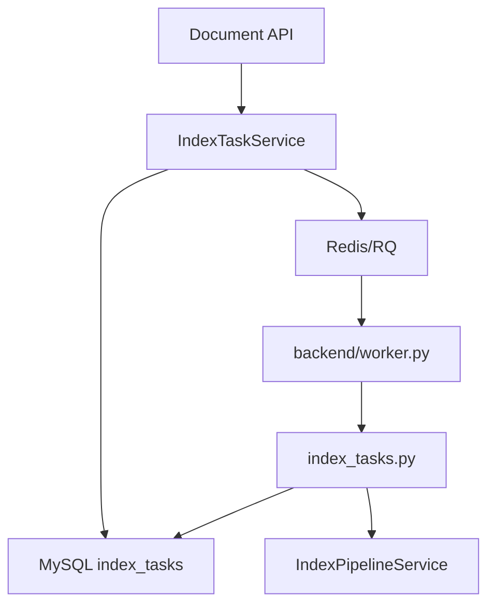

# Tasks Module

## 功能

`app/tasks` 保存 RQ Worker 可执行的离线任务函数，当前主要负责文档索引构建和索引发布。

任务状态统一写入 `index_tasks` 表，支持 `pending/running/success/failed/canceled`，并记录进度、错误信息、RQ Job ID、开始时间和完成时间。

## 调用关系



## 输入

- `task_id`：`index_tasks.id`。
- Redis 配置：`REDIS_HOST/REDIS_PORT/REDIS_DB/RQ_QUEUE_NAME`。

## 输出

- 成功任务写入 `result_json`。
- 失败任务写入 `error_message`，并使用 `logger.exception()` 记录异常栈。

## 平台说明

- Linux/macOS 默认使用 `rq.Worker`。
- Windows 启动 `backend/worker.py` 时会自动切换为 `rq.SimpleWorker`，
  并将超时控制切换为 `TimerDeathPenalty`，
  避免 `os.fork()` 和 `SIGALRM` 不可用导致 Worker 启动后或执行任务时异常退出。

## 示例

```powershell
cd backend
python worker.py
```

## 自检

- 任务函数只接收简单参数，避免序列化 ORM 对象。
- Worker 内部自行创建 `SessionLocal`，任务结束必须关闭数据库连接。
- Redis 未启用时，`IndexTaskService` 会同步降级执行，保证开发环境可用。
