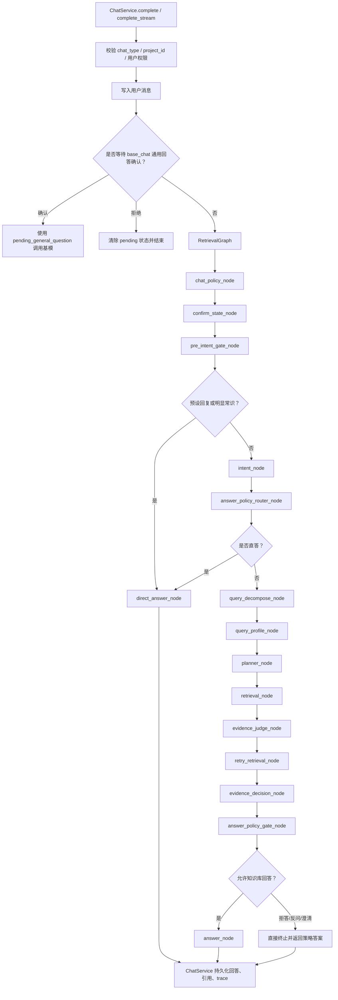

# Agentic RAG 在线检索完整流程

本文档描述当前系统在线问答时的 Agentic RAG 检索链路，重点覆盖 `project_chat` 和 `base_chat` 在真实请求中的入口、策略节点、检索规划、多路召回、权限过滤、重排、证据判断、答案门控和响应结构。

## 1. 入口与会话层

在线问答入口在 `ChatService`：

- 同步问答：`ChatService.complete`
- 流式问答：`ChatService.complete_stream`

请求进入后先执行：

1. 校验 `chat_type`、`project_id`、当前用户权限。
2. 获取或创建 `ChatSession`。
3. 写入用户消息。
4. 如果当前会话处于 `AWAITING_GENERAL_CONFIRM`，优先处理基础问答的通用知识确认。
5. 其余请求进入 `AgentExecutor -> RetrievalGraph`。

`project_chat` 必须携带 `project_id`，并在进入图之前完成项目权限校验。

## 2. 总体流程图



## 3. RetrievalGraph 节点顺序

当前图节点顺序为：

1. `chat_policy_node`
2. `confirm_state_node`
3. `pre_intent_gate_node`
4. `intent_node`
5. `answer_policy_router_node`
6. `query_decompose_node`
7. `query_profile_node`
8. `planner_node`
9. `retrieval_node`
10. `evidence_judge_node`
11. `retry_retrieval_node`
12. `evidence_decision_node`
13. `answer_policy_gate_node`
14. `answer_node`

直答、拒答、反问和澄清会提前终止，不进入后续无意义节点。

## 4. 模式策略

`chat_policy_node` 根据 `chat_type` 初始化本轮基础策略：

| chat_type | 默认策略 | 含义 |
| --- | --- | --- |
| `project_chat` | `STRICT_KB` | 项目资料问题必须基于项目知识库证据回答 |
| `base_chat` | `KB_FIRST_CONFIRM_GENERAL` | 优先基础知识库，证据不足时先询问是否使用通用知识 |

同时固定在线检索参数：

| 参数 | 当前值 | 说明 |
| --- | ---: | --- |
| `candidate_k` | 100 | 每路召回候选规模 |
| `rerank_top_k` | 30 | 进入真实 reranker 的候选规模 |
| `eval_top_k` | 100 | 证据判断保留规模 |
| `answer_top_k` | 10 | 最终答案生成只使用 Top10 |
| `require_real_reranker` | true | 必须使用真实 reranker |
| `allow_reranker_fallback` | false | 禁止 fallback reranker |

## 5. 快速分支

`pre_intent_gate_node` 在调用意图模型前处理无需检索的问题：

| intent_type | answer_policy | 行为 |
| --- | --- | --- |
| `greeting` | `PRESET_REPLY` | 返回固定问候 |
| `bot_identity` | `PRESET_REPLY` | 返回固定身份说明 |
| `help` | `PRESET_REPLY` | 返回固定能力说明 |
| `obvious_common_knowledge` | `DIRECT_GENERAL` | 直接基模回答，不引用知识库 |

预设回复：

- 问候：`您好，我是博萃循环AI智能体，请问有什么可以帮助您的吗？`
- 身份/帮助：`我是博萃循环AI智能体，可以帮助您查询已授权的知识库资料、项目资料和基础知识。`

明显常识会避开知识库，例如简单数学、水的化学式等。行业知识、项目事实、资料查询、图纸、设备、参数、工艺、合同等不会走常识直答。

## 6. 意图识别

`intent_node` 调用 `QwenOrchestrationService.detect_route_decision`，返回兼容旧字段和新策略字段的结构。

核心字段：

```json
{
  "intent_type": "greeting | bot_identity | help | obvious_common_knowledge | project_fact | document_lookup | parameter_query | drawing_or_page_location | industry_knowledge | kb_question | calculation_with_context | confirm_general_answer | reject_general_answer | ambiguous",
  "chat_type": "project_chat | base_chat",
  "need_retrieval": true,
  "allow_direct_llm": false,
  "answer_policy": "STRICT_KB | KB_FIRST_CONFIRM_GENERAL | DIRECT_GENERAL | PRESET_REPLY | CLARIFY",
  "confidence": 0.0,
  "reason": "..."
}
```

系统仍保留旧字段 `intent`、`route`、`direct_answer`、`knowledge_scope`，用于兼容现有 planner、retriever 和 trace。

## 7. 答案策略路由

`answer_policy_router_node` 根据 `chat_type + intent_type` 生成最终 `answer_policy`：

| 场景 | answer_policy |
| --- | --- |
| 问候、身份、帮助 | `PRESET_REPLY` |
| 明显常识 | `DIRECT_GENERAL` |
| 不明确问题 | `CLARIFY` |
| `project_chat` 项目事实/资料类问题 | `STRICT_KB` |
| `base_chat` 知识库/行业知识问题 | `KB_FIRST_CONFIRM_GENERAL` |

## 8. 查询拆解与查询画像

`query_decompose_node` 会生成子查询列表，通常包含原问题；对于项目概览、精确查找、页码/图纸定位、图谱推理等意图，会追加扩展短语和关键词。

`query_profile_node` 构建查询画像，包括：

- `query_type`
- `answer_shape`
- `knowledge_scope`
- `need_page_location`
- `need_exact_term`
- `need_visual_asset`
- `need_graph_reasoning`
- 实体、关键词、语言、查询长度等特征

这些特征会传递给 planner、retriever、视觉证据增强和答案生成。

## 9. 检索规划

`planner_node` 调用 `RetrievalPlannerService.plan` 得到检索计划，然后执行默认 hybrid 强制规则。

当前规则：

1. 所有非直答问题默认必须保留 `milvus + keyword`。
2. planner 不允许取消默认 hybrid。
3. planner 只能追加 `ripgrep`、`page_index`、`graphrag` 或调整权重。
4. 计划写入：
   - `selected_retrievers`
   - `fallback_ladder`
   - `skipped_retrievers`
   - `skip_reasons`
   - `query_features`
   - `metadata`

## 10. 多路召回

`retrieval_node` 逐个子查询调用 `RetrievalRouter.execute_planned`。

默认召回形态：

```text
Milvus Top candidate_k
+ keyword/BM25 Top candidate_k
+ 可选 ripgrep / PageIndex / GraphRAG
-> 合并
-> 权限过滤
-> 真实 Reranker
-> 证据增强
```

当前可用 retriever：

| retriever | 用途 |
| --- | --- |
| `milvus` | 向量语义召回 |
| `keyword` | 关键词/BM25 类召回 |
| `page_index` | 页级定位召回 |
| `ripgrep` | 文件级精确文本召回 |
| `graphrag` | 图谱关系召回 |

`RetrievalRouter` 会按 `fallback_ladder` 分阶段执行，并根据阶段质量决定是否继续后续 fallback。

## 11. 权限过滤

在线检索链路有多层权限防线：

1. `ChatService` 入口校验项目访问权限。
2. 各 retriever 按 `chat_type/mode/project_id/user` 做范围过滤。
3. `RetrievalRouter._filter_evidences_for_reranker` 在每路召回后，对证据做候选集整理与重排前过滤。
4. `RetrievalGraph._filter_evidences_before_rerank` 在统一 rerank 前再次过滤。
5. `RetrievalGraph._assert_answer_evidences_allowed` 在答案生成前最终断言。

目标是保证无权正文不会进入 reranker，也不会进入 AnswerGenerator。

## 12. 合并与真实重排

多路召回结果进入 `EvidenceMerger.merge` 合并去重。

之后：

1. 先保留 `merge_limit = max(eval_top_k, rerank_top_k, candidate_k)` 范围内候选。
2. 执行 rerank 前 DB 权限过滤。
3. 取 `rerank_top_k=30` 进入真实 reranker。
4. reranker 输出后截断到 `eval_top_k=100`。
5. 记录：
   - `retrieval_before_rerank_doc_ids`
   - `retrieval_before_rerank_scores`
   - `rerank_after_doc_ids`
   - `rerank_after_scores`
   - `reranker_runtime`
   - `rerank_elapsed_ms`

真实 reranker 要求：

- `require_real_model=true`
- `allow_reranker_fallback=false`

## 13. 视觉证据增强

重排后的 evidence 会进入 `VisualEvidenceService.enrich`。

如果 query profile 判断需要图纸、页面、视觉资产，系统会把相关图片资产挂到 evidence 上，供后续视觉阅读 trace 和答案生成使用。

## 14. 证据判断

`evidence_judge_node` 判断当前证据是否足够回答。

输出 `evidence_judgement`，主要字段：

- `enough`
- `reason`
- `suggested_retrievers`
- `suggested_queries`
- `evidence_count`
- `source`

如果证据不足，进入 `retry_retrieval_node`，最多补充检索一次。补充检索仍走真实权限过滤和真实 reranker。

## 15. 证据状态归一化

`evidence_decision_node` 将模型判断和检索状态归一化为 `evidence_status`：

| evidence_status | 含义 |
| --- | --- |
| `ENOUGH` | 证据足够，允许知识库回答 |
| `WEAK` | 有证据但支撑不足 |
| `EMPTY` | 没有检索到可用证据 |
| `IRRELEVANT` | 证据与问题无关 |
| `CONFLICTED` | 证据存在冲突 |
| `UNAUTHORIZED_ONLY` | 仅命中无权资料或权限过滤后无可用证据 |

只有 `ENOUGH` 可以进入知识库答案生成。

## 16. 答案门控

`answer_policy_gate_node` 根据 `answer_policy + evidence_status` 决定最终动作。

### project_chat

| evidence_status | 行为 |
| --- | --- |
| `ENOUGH` | 基于知识库 Top10 证据回答 |
| `WEAK / EMPTY / IRRELEVANT / CONFLICTED / UNAUTHORIZED_ONLY` | 拒答 |

项目问答拒答：

```text
当前项目知识库中未检索到足够可靠的资料支持回答，因此无法回答该问题。请补充相关项目资料，或调整问题后重试。
```

项目问答不允许基模补充项目事实。

### base_chat

| evidence_status | 行为 |
| --- | --- |
| `ENOUGH` | 基于知识库 Top10 证据回答 |
| `WEAK / EMPTY / IRRELEVANT` | 反问是否使用通用知识 |
| `CONFLICTED` | 说明知识库资料冲突 |
| `UNAUTHORIZED_ONLY` | 拒答 |

基础问答无资料反问：

```text
我没有在当前知识库中检索到足够可靠的资料。是否需要我基于通用知识进行回答？该回答将不引用知识库资料。
```

用户确认后，`ChatService` 使用 `pending_general_question` 调用基模，并添加前缀：

```text
以下内容基于通用知识生成，未引用当前知识库资料：
```

用户拒绝后，清空 pending 状态并结束。

## 17. 答案生成

`answer_node` 只在以下条件满足时执行：

1. `answer_policy` 允许知识库回答。
2. `evidence_status=ENOUGH`。
3. 最终 evidence 通过答案前权限断言。

生成前固定：

- `answer_top_k=10`
- 只把 Top10 evidence 传给 `AnswerGenerator.generate`
- 所有知识库回答都必须有 sources

`AnswerGenerator` 负责调用答案模型，并根据 evidence 生成有来源依据的回答。

## 18. 流式输出流程

流式接口 `ChatService.complete_stream` 使用 `RetrievalGraph.prepare_stream`：

1. 每个节点开始前输出 `trace_delta`。
2. 节点完成后输出对应 trace。
3. 如果快速直答、拒答、反问、澄清，直接输出答案并结束。
4. 如果需要知识库回答，先输出回答生成中的 trace，再流式输出 answer token。
5. 最后 `finalize_answer` 写回回答节点 trace，并持久化。

## 19. 持久化与审计

回答完成后 `ChatService._persist_agent_result` 写入：

- `chat_messages`
- `chat_citations`
- `retrieval_traces`
- 系统操作日志

如果本轮是 `base_chat` 证据不足反问，还会在 `chat_sessions` 写入：

- `conversation_state = AWAITING_GENERAL_CONFIRM`
- `pending_general_question = 原始问题`
- `pending_chat_type = base_chat`

## 20. 响应结构

最终响应包含：

```json
{
  "answer": "...",
  "answer_type": "kb_grounded | general_llm | preset | refusal | need_general_confirm | clarify",
  "chat_type": "project_chat | base_chat",
  "intent_type": "...",
  "answer_policy": "STRICT_KB | KB_FIRST_CONFIRM_GENERAL | DIRECT_GENERAL | PRESET_REPLY | CLARIFY",
  "evidence_status": "ENOUGH | WEAK | EMPTY | IRRELEVANT | CONFLICTED | UNAUTHORIZED_ONLY",
  "sources": [],
  "need_user_confirm": false,
  "pending_action": null,
  "used_retrievers": [],
  "trace": [],
  "raw": {
    "candidate_k": 100,
    "rerank_top_k": 30,
    "answer_top_k": 10,
    "reranker_used": true,
    "direct_llm_used": false,
    "kb_grounded": true,
    "refused": false,
    "need_general_confirm": false
  }
}
```

`citations` 与 `sources` 当前保持同源，前端可优先使用 `sources` 表达统一来源。

## 21. project_chat 与 base_chat 对比

| 维度 | project_chat | base_chat |
| --- | --- | --- |
| 是否需要 project_id | 必须 | 不需要 |
| 权限校验 | 必须执行项目权限和资料权限过滤 | 执行基础知识库资料权限过滤 |
| 问候/身份/帮助 | 预设回复 | 预设回复 |
| 明显常识 | 基模直答，不引用知识库 | 基模直答，不引用知识库 |
| 资料类问题 | 必须知识库证据 | 优先知识库证据 |
| 证据不足 | 直接拒答 | 先询问是否使用通用知识 |
| 是否允许基模补项目事实 | 不允许 | 不适用 |
| 知识库回答来源 | 必须有 sources | 必须有 sources |

## 22. 关键代码位置

| 模块 | 职责 |
| --- | --- |
| `backend/app/services/chat_service.py` | 会话、权限入口、pending 通用回答确认、持久化 |
| `backend/app/agent/executor.py` | 兼容旧 AgentExecutor 调用入口 |
| `backend/app/langgraph/retrieval_graph.py` | Agentic RAG 编排主图 |
| `backend/app/services/qwen_orchestration_service.py` | 意图识别、查询拆解、证据判断、通用回答 |
| `backend/app/services/retrieval_planner_service.py` | 检索计划生成 |
| `backend/app/retrieval/router.py` | 多 retriever 分阶段执行与权限过滤 |
| `backend/app/retrieval/retrievers/*` | Milvus、keyword、PageIndex、ripgrep、GraphRAG 具体召回 |
| `backend/app/retrieval/merger.py` | 多路 evidence 合并 |
| `backend/app/services/reranker_service.py` | 真实 reranker 重排 |
| `backend/app/services/visual_evidence_service.py` | 视觉证据增强 |
| `backend/app/agent/answer_generator.py` | 基于 Top10 evidence 生成答案 |
