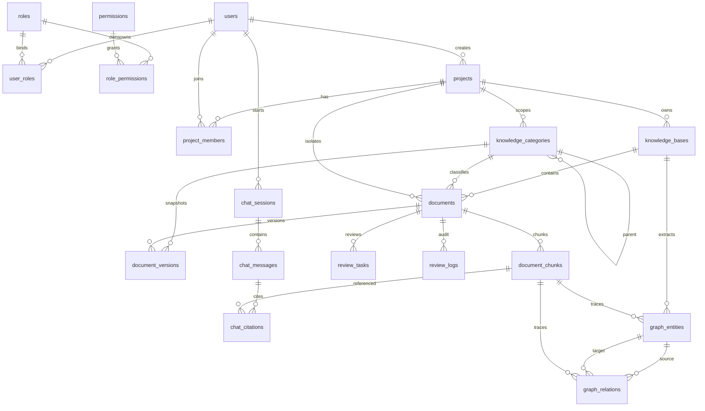

# Botree Agent 数据库设计

## 1. 数据库总体说明

Botree Agent / Botree Knowledge OS 是企业内部知识管理与智能体应用平台。数据库围绕“用户权限、项目隔离、知识库、文档审核、知识分块、AI 问答审计、GraphRAG 扩展”建模。

核心规则：

- 基础知识通过 `knowledge_bases.type = base` 跨项目复用。
- 项目知识通过 `project_id` 绑定项目，检索和问答必须按项目成员权限过滤。
- 知识分类使用 `knowledge_categories` 邻接表实现无限层级；企业分类为 `scope_type = base` 且 `project_id = NULL`，项目分类为 `scope_type = project` 且绑定项目。
- 文档上传后默认 `review_status = draft`，只有 `review_status = approved`、`index_status = indexed`、`document_chunks.chunk_status = active` 且 Chunk 版本号等于文档当前版本号的内容可以进入问答。
- 同一文档的新版本通过 `document_versions` 递增版本号；上传新版本会将旧 Chunk/索引置为 `obsolete`，保留历史引用显示，但检索只命中当前最新版本。
- 所有 AI 引用来源必须追溯到 `knowledge_base_id`、`project_id`、`document_id`、`chunk_id`、`page_number`。
- AI 会话通过 `chat_type` 区分 `project_chat` 项目问答和 `base_chat` 基础问答。
- 全部表包含 `created_at`、`updated_at`，初始化脚本中全部表和字段均带 `COMMENT`。

## 2. ER 关系图

## 3. 表说明

| 表名 | 表注释 | 说明 |
| --- | --- | --- |
| `users` | 用户主表 | 保存登录用户、部门、状态和联系方式。 |
| `roles` | 角色表 | 保存管理员、知识工程师、只读用户等角色。 |
| `permissions` | 权限表 | 保存模块动作权限点。 |
| `user_roles` | 用户角色关联表 | 维护用户与角色的多对多关系。 |
| `role_permissions` | 角色权限关联表 | 维护角色与权限点的多对多关系。 |
| `projects` | 项目主表 | 项目级知识隔离边界。 |
| `project_members` | 项目成员表 | 控制用户是否可访问项目知识。 |
| `knowledge_bases` | 知识库表 | 区分基础知识库和项目知识库。 |
| `knowledge_categories` | 知识分类表 | 动态无限层级分类，按企业全局或项目范围隔离。 |
| `knowledge_base_permissions` | 知识库授权表 | 预留用户、角色、项目、外部用户授权能力。 |
| `documents` | 文档主表 | 保存资料元数据、分类、审核状态、构建状态和来源字段。 |
| `document_versions` | 文档版本表 | 保存同一资料的版本链和版本分类快照。 |
| `document_chunks` | 文档切块表 | 检索和问答引用的最小证据单元，通过版本号和状态区分当前有效 Chunk 与历史引用 Chunk。 |
| `review_tasks` | 审核任务表 | 记录待审核、通过、驳回任务。 |
| `review_logs` | 审核日志表 | 记录提交、通过、驳回、归档动作。 |
| `chat_sessions` | 智能体会话表 | 保存用户会话、问答模式和项目上下文。 |
| `chat_messages` | 智能体消息表 | 保存用户问题、助手回答和 Agent 执行过程。 |
| `chat_citations` | 智能体引用来源表 | 保存回答引用的文档与 Chunk 来源。 |
| `model_configs` | 模型配置表 | 保存 LLM、Embedding、Reranker 配置。 |
| `operation_logs` | 操作日志表 | 保存登录、上传、审核、解析、索引、问答等操作。 |
| `system_configs` | 系统配置表 | 保存平台级 key/value 配置。 |
| `graph_entities` | 知识图谱实体表 | 预留实体抽取和图谱检索能力。 |
| `graph_relations` | 知识图谱关系表 | 预留实体关系抽取和 GraphRAG 能力。 |

## 4. 字段说明

| 表名 | 关键字段 |
| --- | --- |
| `users` | `id` 主键；`username` 登录用户名；`password_hash` 密码哈希；`real_name` 真实姓名；`department` 部门；`status` 状态：`enabled/disabled`；`created_at/updated_at` 时间戳。 |
| `roles` | `id` 主键；`name` 角色名称；`code` 角色编码；`enabled` 是否启用；`created_at/updated_at` 时间戳。 |
| `permissions` | `id` 主键；`module` 权限模块；`action` 权限动作：`view/create/update/delete/review/auth`；`code` 权限编码。 |
| `projects` | `id` 主键；`name` 项目名称；`code` 项目编码；`client` 客户；`manager` 项目经理；`status` 项目状态：`active/completed/pending/archived`；`created_by` 创建人。 |
| `project_members` | `project_id` 所属项目；`user_id` 项目成员；`role` 项目角色：`owner/manager/member/viewer/external`；`permission_scope` 权限范围：`project_manage/project_read/authorized_only`。 |
| `knowledge_bases` | `type` 知识库类型：`base/project`；`project_id` 项目知识库关联项目；`visibility` 可见性：`internal/authorized/private`；`enabled` 是否启用。 |
| `knowledge_categories` | `scope_type` 分类范围：`base/project`；`project_id` 项目分类所属项目，企业分类为空；`parent_id` 父分类；`name/code` 分类名称和编码；`enabled` 是否启用；`created_by` 创建人。 |
| `knowledge_base_permissions` | `knowledge_base_id` 授权知识库；`subject_type` 主体类型：`user/role/external_user`；`permission` 授权：`read/manage`；`expires_at` 授权过期时间。 |
| `documents` | `knowledge_base_id` 所属知识库；`knowledge_type` 知识类型：`base/project`；`project_id` 项目隔离字段；`category_id` 当前知识分类；`review_status` 审核状态：`draft/submitted/reviewing/approved/rejected/archived`；`index_status` 构建状态：`not_indexed/parsing/parsed/indexing/indexed/failed`；`build_started_at/build_finished_at/build_error/built_by` 合并构建进度字段；`drawing_no/drawing_name` 图纸来源信息。 |
| `document_versions` | `document_id` 关联文档；`version_no` 同一文档版本号；`category_id` 版本分类快照；`review_status/index_status` 版本状态；`is_current` 是否当前版本。 |
| `document_chunks` | `document_id` 来源文档；`version_no` 所属文档版本号；`chunk_status` 状态：`active/obsolete`；`chunk_index` 切块序号；`content` Chunk 内容；`page_number` 页码；`section_title` 章节；`metadata_json` 包含文件名、版本号、分类、项目和知识库来源；`vector_id` 后续关联 Milvus。 |
| `review_tasks` | `document_id` 审核文档；`reviewer_id` 审核人；`review_status` 审核状态：`reviewing/approved/rejected`；`reviewed_at` 审核时间。 |
| `review_logs` | `document_id` 关联文档；`action` 审核动作：`submit/approve/reject/archive`；`operator_id` 操作人；`comment` 操作说明。 |
| `chat_sessions` | `user_id` 会话用户；`chat_type` 问答类型：`project_chat/base_chat`；`mode` 问答模式：`auto/base_only/project_only/hybrid`；`project_id` 项目问答上下文。 |
| `chat_messages` | `session_id` 会话；`role` 消息角色：`user/assistant`；`content` 消息内容；`query_scope` 查询范围；`agent_trace_json` Agent 执行过程。 |
| `chat_citations` | `message_id` 助手消息；`source_type` 来源类型：`base/project/authorized_internal`；`knowledge_base_id/project_id/document_id/chunk_id` 完整来源追踪；`page_number` 页码；`content` 引用片段。 |
| `model_configs` | `provider` 模型供应商；`model_name` 模型名称；`api_base` API 地址；`api_key` API Key；`model_type` 类型：`llm/embedding/reranker`；`is_default` 是否默认。 |
| `operation_logs` | `user_id/username` 操作人；`action` 操作动作；`target_type/target_id` 操作对象；`result` 执行结果：`success/failed`。 |
| `system_configs` | `config_key` 配置键；`config_value` 配置值；`description` 配置说明。 |
| `graph_entities` | `entity_type` 实体类型；`entity_code` 实体编码；`entity_name` 实体名称；`knowledge_base_id/project_id/document_id/chunk_id` 来源追踪。 |
| `graph_relations` | `source_entity_id/target_entity_id` 关系两端实体；`relation_type` 关系类型；`document_id/chunk_id` 来源追踪。 |

## 5. 索引说明

初始化脚本中的索引均显式命名，避免数据库自动生成不可维护名称。

| 索引 | 表 | 说明 |
| --- | --- | --- |
| `uk_users_username` | `users` | 用户名唯一。 |
| `uk_roles_name` / `uk_roles_code` | `roles` | 角色名称、编码唯一。 |
| `uk_permissions_code` | `permissions` | 权限编码唯一。 |
| `uk_projects_code` | `projects` | 项目编码唯一。 |
| `uk_knowledge_bases_code` | `knowledge_bases` | 知识库编码唯一。 |
| `idx_project_members_project_id` / `idx_project_members_user_id` | `project_members` | 项目成员权限过滤。 |
| `idx_knowledge_categories_scope` / `idx_knowledge_categories_project_id` / `idx_knowledge_categories_parent_id` | `knowledge_categories` | 分类范围、项目隔离和父级树查询。 |
| `uk_knowledge_categories_scope_code` | `knowledge_categories` | 分类编码在同一范围内唯一，服务层额外处理 `project_id IS NULL` 的企业分类去重。 |
| `idx_documents_knowledge_base_id` / `idx_documents_project_id` | `documents` | 知识库和项目资料查询。 |
| `idx_documents_category_id` | `documents` | 按动态分类筛选资料。 |
| `idx_documents_review_status` / `idx_documents_index_status` | `documents` | 审核、构建状态过滤。 |
| `idx_document_versions_category_id` / `idx_document_versions_document_id` | `document_versions` | 版本列表和版本分类快照查询。 |
| `idx_document_chunks_document_id` / `idx_document_chunks_project_id` | `document_chunks` | Chunk 查询和项目隔离检索。 |
| `idx_document_chunks_version_no` / `idx_document_chunks_chunk_status` | `document_chunks` | 当前版本 Chunk 过滤和历史 Chunk 状态隔离。 |
| `idx_review_tasks_document_id` / `idx_review_tasks_review_status` | `review_tasks` | 审核中心列表和详情。 |
| `idx_chat_sessions_user_id` / `idx_chat_sessions_chat_type` / `idx_chat_messages_session_id` | `chat_*` | 会话历史和问答入口过滤。 |
| `idx_chat_citations_message_id` | `chat_citations` | 助手回答引用查询。 |
| `idx_graph_entities_*` / `idx_graph_relations_*` | `graph_*` | GraphRAG 实体和关系检索。 |

## 6. GraphRAG 实体关系说明

MVP 当前先实现关键词和数据库检索，图谱能力通过表结构预留：

- `document_chunks` 是检索和图谱抽取的共同来源。
- 新版本上传和重新构建会将同一文档旧 Chunk/索引置为 `obsolete`，历史问答引用仍可通过原 `chunk_id` 展示快照内容。
- 检索和问答只读取 `chunk_status = active` 且 `version_no = documents.version_no` 的 Chunk。
- `graph_entities` 保存从 Chunk 中抽取的设备、管线、仪表、术语、指标等实体。
- `graph_relations` 保存实体之间的关系，如“属于、连接、影响、依据、约束”。
- 每条实体和关系都保留 `knowledge_base_id`、`project_id`、`document_id`、`chunk_id`，确保后续 GraphRAG 回答仍能追溯来源。
- 项目实体必须携带 `project_id`，后续图谱检索必须按项目成员权限过滤。

## 7. 用户权限模型说明

权限模型分三层：

1. 平台 RBAC：`users -> user_roles -> roles -> role_permissions -> permissions` 控制模块操作能力。
2. 项目授权：`project_members` 控制用户可访问的项目范围，AI 项目问答必须校验用户是否为项目成员或管理员。
3. 知识授权：`knowledge_base_permissions` 预留基础知识、项目知识、项目授权和外部用户授权能力，项目问答可通过 `subject_type = project` 将基础知识授权给指定项目。

审核中心权限：

- `review:view`：查看审核任务和审核通过资料/构建进度。
- `review:review`：执行审核通过、驳回，以及“解析并构建索引”操作。

默认管理员：

- 初始化 SQL 只创建角色和权限，不写入固定管理员密码。
- 应用启动时会读取 `.env` 中的 `DEFAULT_ADMIN_USERNAME` 与 `DEFAULT_ADMIN_PASSWORD` 创建管理员账号。
- 如果未配置 `DEFAULT_ADMIN_PASSWORD`，系统会跳过默认管理员创建并记录 warning 日志。

## 8. 后端改造新增表说明

本次后端改造在保留原有用户、项目、知识库、文档、审核、会话和图谱表的基础上，补充离线索引、页级定位和检索审计能力。

| 表名 | 表注释 | 说明 |
| --- | --- | --- |
| `document_pages` | 文档页级解析表 | 保存 MinerU 页级解析结果，包含 `project_id/document_id/version_no/drawing_no/page_no/page_text/layout_json/correction_status`；其中 `layout_json` 使用 `LONGTEXT` 承载页级版面结构，作为 PageIndex、ripgrep 文本镜像和 citation 页级追踪的基础。 |
| `document_page_blocks` | 文档页内块表 | 保存页内文本、表格、图片、标题等块级结构，包含 `block_type/bbox_json/content/metadata_json`，用于后续人工修正和版面级召回。 |
| `document_assets` | 文档派生资产表 | 保存转换 PDF、MinerU 原始结果、页预览图和块级图片等派生文件，包含 `asset_type/storage_backend/storage_path/object_key/status`，用于原始内容预览和删除清理。 |
| `page_indexes` | PageIndex页级索引表 | 保存可发布的页级索引记录，包含 `chunk_id/text_mirror_path/status`，状态取值为 `staging/published/obsolete`。 |
| `index_tasks` | 离线索引任务表 | 保存 RQ 任务状态，包含 `task_type/status/progress/error_message/rq_job_id/started_at/finished_at`，状态取值为 `pending/running/success/failed/canceled`。 |
| `retrieval_traces` | 检索问答审计Trace表 | 保存 LangGraph 在线问答链路，包含意图、子查询、多路召回统计、Reranker 结果、最终引用和耗时。 |

新增字段同步要求：

- `chat_citations.drawing_no`：回答引用必须能追溯到图纸编号。
- `graph_entities.version_no/drawing_no/page_number/status`：实体必须携带文档版本、图纸号、页码和发布状态。
- `graph_relations.version_no/drawing_no/page_number/status`：关系必须携带文档版本、图纸号、页码和发布状态。
- `model_configs.model_type`：取值扩展为 `llm/embedding/reranker/intent/evidence_judge/graph_extractor`。

## 9. 新增索引说明

| 索引 | 表 | 说明 |
| --- | --- | --- |
| `idx_document_pages_document_id` / `idx_document_pages_page_no` | `document_pages` | 支撑按文档和页码查看解析结果。 |
| `idx_document_pages_project_id` / `idx_document_pages_drawing_no` | `document_pages` | 支撑项目隔离和图纸号定位。 |
| `idx_document_assets_document_id` / `idx_document_assets_version_no` | `document_assets` | 支撑按文档版本加载转换 PDF、MinerU 原始结果和预览资产。 |
| `idx_document_assets_asset_type` / `idx_document_assets_status` | `document_assets` | 支撑按资产类型筛选当前版本可用预览资源，并在文档删除时快速清理。 |
| `idx_page_indexes_document_id` / `idx_page_indexes_status` | `page_indexes` | 支撑 staging/published 发布机制和在线检索过滤。 |
| `idx_page_indexes_chunk_id` / `idx_page_indexes_page_no` | `page_indexes` | 支撑 citation 映射回 chunk 和页码。 |
| `idx_index_tasks_document_id` / `idx_index_tasks_status` | `index_tasks` | 支撑离线任务列表、重试和状态查询。 |
| `idx_retrieval_traces_message_id` / `idx_retrieval_traces_created_at` | `retrieval_traces` | 支撑按消息追踪和管理员审计。 |
| `idx_graph_entities_status` / `idx_graph_relations_status` | `graph_*` | 支撑 GraphRAG staging/published 发布过滤。 |

## 10. GraphRAG 来源追踪规则

在线问答所有 Evidence 最低必须携带：

`project_id / knowledge_base_id / document_id / drawing_no / page_no / chunk_id / source_type / score / metadata`

GraphRAG 第一阶段使用 MySQL 图谱表，不引入 Neo4j。实体和关系从 `document_chunks` 与 `document_pages` 生成，先写入 `staging`，发布后变为 `published`；旧版本发布索引会变为 `obsolete`。在线检索只能使用已发布索引，并且 Milvus、ripgrep、PageIndex、GraphRAG 召回后必须回 MySQL 做权限、审核状态和版本状态二次校验。
