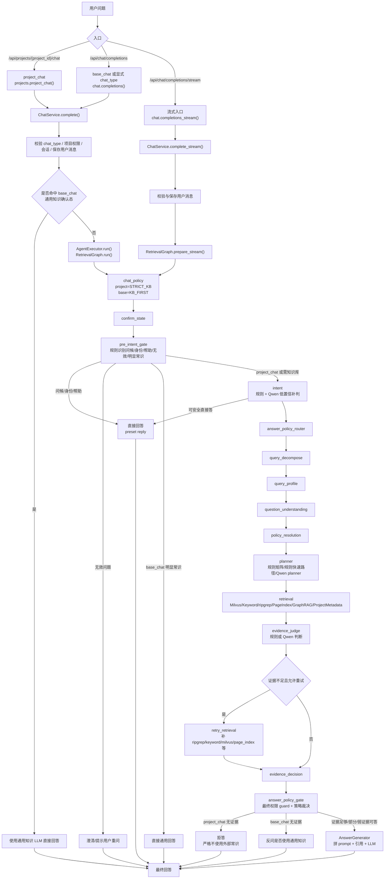
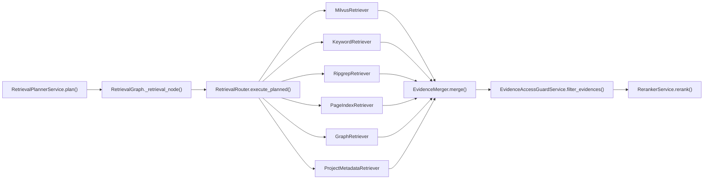
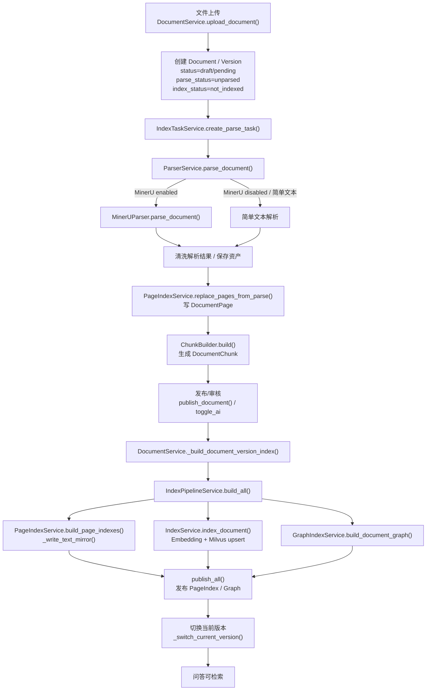

# Botree Agent RAG 链路当前实现资料包

> 生成时间：2026-06-29  
> 扫描范围：后端问答入口、LangGraph/RetrievalGraph、问题理解、检索规划、多路检索、Reranker、证据判断、回答生成、权限密级、离线索引、配置、日志与评测。  
> 说明：本文只记录当前代码事实，不描述理想方案；未发现的能力明确标记为“当前未发现实现”。行号以当前工作区代码为准。

## 1. 总体结论

1. 当前问答入口主要有统一聊天接口 `/api/chat/completions`、`/api/chat/completions/stream`，以及项目问答接口 `/api/projects/{project_id}/chat`；路由证据见 `backend/app/api/chat.py:21`、`backend/app/api/chat.py:94`、`backend/app/api/chat.py:101`、`backend/app/api/projects.py:481`、`backend/main.py:95`。
2. RAG 主链路集中在 `RetrievalGraph`，通过 `AgentExecutor.run()` 调用，支持 LangGraph 编译链路和顺序降级链路；证据见 `backend/app/agent/executor.py:26`、`backend/app/langgraph/retrieval_graph.py:139`、`backend/app/langgraph/retrieval_graph.py:478`、`backend/app/langgraph/retrieval_graph.py:590`。
3. `project_chat` 默认采用严格知识库策略，证据不足时拒答；`base_chat` 默认采用 KB-first，证据为空时会反问是否使用通用知识；证据见 `backend/app/langgraph/retrieval_graph.py:769`、`backend/app/services/answer_policy_gate_service.py:107`、`backend/app/services/answer_policy_gate_service.py:136`、`backend/app/services/chat_service.py:770`。
4. 问题理解由规则和 LLM 混合完成：预意图门禁先处理问候、身份、帮助、无效问题和明显常识；低置信度再调用 Qwen 意图识别；证据见 `backend/app/langgraph/retrieval_graph.py:806`、`backend/app/langgraph/retrieval_graph.py:884`、`backend/app/services/qwen_orchestration_service.py:204`。
5. 检索规划存在规则矩阵、快速规则和 Qwen planner 三层；planner prompt 在 `rag_prompt_templates.py`，但当前未发现独立的 planner 开关配置；证据见 `backend/app/services/retrieval_planner_service.py:265`、`backend/app/services/retrieval_planner_service.py:582`、`backend/app/services/retrieval_planner_service.py:1270`、`backend/app/services/rag_prompt_templates.py:13`。
6. 在线多路检索包含 Milvus、Keyword、ripgrep、PageIndex、GraphRAG、ProjectMetadata，并由 `RetrievalRouter.execute_planned()` 按计划并发执行、合并、降级；证据见 `backend/app/retrieval/router.py:249`、`backend/app/retrieval/router.py:531`、`backend/app/retrieval/router.py:1209`。
7. 线上“BM25 / 全文”当前更准确地说是 `KeywordRetriever`，不是标准 BM25；标准 BM25 主要出现在 BEIR 评测选项中。证据见 `backend/app/retrieval/retrievers/keyword_retriever.py:24`、`eval/beir/cli.py:16`。
8. Reranker 支持真实本地 CrossEncoder 和确定性 fallback；线上 Graph 默认要求真实 reranker 且禁用 fallback，评测/prepare 可传入不同参数；证据见 `backend/app/services/reranker_service.py:61`、`backend/app/services/reranker_service.py:163`、`backend/app/services/reranker_service.py:226`、`backend/app/langgraph/retrieval_graph.py:428`。
9. 权限与密级过滤覆盖入口校验、检索前/检索中回查、回答前最终 guard，但 `Evidence` dataclass 没有顶层 `security_level` 字段，依赖 `metadata.security_level`，可观测性和强断言仍有缺口；证据见 `backend/app/retrieval/schemas.py:34`、`backend/app/services/evidence_access_guard_service.py:48`、`backend/app/services/project_document_policy_service.py:92`。
10. 离线索引链路已覆盖上传、MinerU/简单解析、chunk、PageIndex、Milvus、GraphRAG、发布和版本切换；旧索引失效以版本号、chunk active、PageIndex 发布态、Milvus obsolete vector 删除为主。证据见 `backend/app/services/document_service.py:383`、`backend/app/services/document_service.py:1183`、`backend/app/services/index_pipeline_service.py:43`。

## 2. RAG 问答入口

| 功能 | 文件路径 | 类/函数 | 作用 | 备注 |
|---|---|---|---|---|
| API 根前缀 | `backend/app/core/config.py:32`、`backend/main.py:84-98` | `Settings.api_prefix`、`app.include_router(...)` | 默认所有业务 API 挂到 `/api` | Chat router 在 `backend/main.py:95` 注册 |
| Chat router | `backend/app/api/chat.py:21` | `router = APIRouter(prefix="/chat")` | AI 中心聊天路由前缀 | 最终路径为 `/api/chat/...` |
| 非流式问答 | `backend/app/api/chat.py:94` | `completions()` | 接收 `ChatCompletionRequest`，调用 `ChatService.complete()` | 需要 `ai:chat` 权限 |
| 流式问答 | `backend/app/api/chat.py:101` | `completions_stream()` | 调用 `ChatService.complete_stream()`，返回 SSE | `text/event-stream`，前端解析见 `frontend/src/api/chat.ts:162` |
| 项目问答入口 | `backend/app/api/projects.py:481` | `project_chat()` | 强制 `chat_type="project_chat"`、`project_id=path project_id` 后调用 `ChatService.complete()` | 需要 `project_chat:ask` |
| 问答核心服务 | `backend/app/services/chat_service.py:302` | `ChatService.complete()` | 校验、建会话、保存用户消息、处理通用知识确认、执行 Agent、持久化回答 | 非流式入口 |
| 流式核心服务 | `backend/app/services/chat_service.py:316` | `ChatService.complete_stream()` | 同步保存输入后，使用 `RetrievalGraph.prepare_stream()` 与 `AnswerGenerator.stream_generate()` 输出 SSE | SSE 事件包含 `meta`、`progress`、`trace_delta`、`delta`、`done` |
| 通用知识确认 | `backend/app/services/chat_service.py:674`、`backend/app/services/chat_service.py:770` | `_try_handle_general_confirmation()`、`_build_general_confirmation_result()` | base_chat 证据不足后，用户确认时走通用知识回答 | 结果标记 `kb_grounded=False`、`direct_llm=True` |
| 结果持久化 | `backend/app/services/chat_service.py:821` | `_persist_agent_result()` | 保存 assistant 消息、引用、pending confirm、retrieval trace、操作日志 | 返回 answer、intent、policy、evidence_status、trace、citations |
| 请求校验 | `backend/app/services/chat_service.py:1104` | `_validate_chat_request()` | 校验 chat_type、project_id、项目权限、外部用户限制 | project_chat 必须有 project_id；外部用户不可 base_chat |
| Agent 调用 | `backend/app/agent/executor.py:26` | `AgentExecutor.run()` | 创建 `RetrievalGraph` 并执行 | Controller 不直接碰检索 |

## 3. 当前 RAG 主流程

关键证据：

- `RetrievalGraph._prepare_node_specs()` 定义主节点清单：`backend/app/langgraph/retrieval_graph.py:478`。
- `RetrievalGraph._try_compile_langgraph()` 定义 LangGraph 边与条件跳转；编译失败降级为顺序执行：`backend/app/langgraph/retrieval_graph.py:590`。
- `project_chat` 策略在 `_chat_policy_node()` 进入 `STRICT_KB`，`base_chat` 进入 `KB_FIRST`：`backend/app/langgraph/retrieval_graph.py:769`。
- 证据不足后的 project/base 差异由 `AnswerPolicyGateService` 决定：`backend/app/services/answer_policy_gate_service.py:107`、`backend/app/services/answer_policy_gate_service.py:136`。

## 4. LangGraph / RetrievalGraph 节点清单

| 节点名称 | 文件路径 | 函数/方法 | 输入 | 输出 | 是否调用 LLM | 是否调用检索 | 失败/降级逻辑 |
|---|---|---|---|---|---|---|---|
| graph state | `backend/app/langgraph/state.py:15` | `RetrievalGraphState` | question、chat_type、project_id、user、raw 等 | 全链路共享状态 | 否 | 否 | 无 |
| chat_policy | `backend/app/langgraph/retrieval_graph.py:769` | `_chat_policy_node()` | chat_type、raw top_k、mode | chat_policy、answer_policy、raw 默认值 | 否 | 否 | base 默认 KB_FIRST；project 默认 STRICT_KB |
| confirm_state | `backend/app/langgraph/retrieval_graph.py:478` | 节点注册；实现位于 `RetrievalGraph` | pending confirm 状态 | 确认态上下文 | 否 | 否 | 未命中则继续 |
| pre_intent_gate | `backend/app/langgraph/retrieval_graph.py:806` | `_pre_intent_gate_node()` | question、chat_type | direct_answer、route_decision、intent | 否 | 否 | 无效问题转澄清；问候/身份/帮助直接预置回答 |
| intent | `backend/app/langgraph/retrieval_graph.py:884` | `_intent_node()` | question、chat_type、mode | route_decision、intent_type、direct_answer | 是，低置信时 | 否 | Qwen 失败回退规则识别；project_chat 常识问题强制项目检索 |
| answer_policy_router | `backend/app/langgraph/retrieval_graph.py:478` | `_answer_policy_router_node()` | intent、chat_policy、direct_answer | answer_policy、是否跳过检索 | 部分场景否 | 否 | 已有 direct_answer 则结束 |
| query_decompose | `backend/app/langgraph/retrieval_graph.py:1565` | `_query_decompose_node()` | question | sub_queries | 否 | 否 | 默认原问题作为子问题 |
| query_profile | `backend/app/langgraph/retrieval_graph.py:1587`、`backend/app/services/query_profile_service.py:137` | `_query_profile_node()`、`QueryProfileService.build_profile()` | question、intent、chat_type | query_profile | 否 | 否 | 规则输出，未知默认偏 industry |
| question_understanding | `backend/app/langgraph/retrieval_graph.py:1632`、`backend/app/services/question_understanding_service.py:286` | `_question_understanding_node()`、`understand()` | question、profile、intent | task_type、scope、policy hints | 否 | 否 | 规则输出 |
| policy_resolution | `backend/app/langgraph/retrieval_graph.py:1671`、`backend/app/services/policy_resolver_service.py:121` | `_policy_resolution_node()`、`PolicyResolver.resolve()` | chat_type、intent、understanding | resolved policy | 否 | 否 | project 强制 strict_kb；base 无证据 ask confirm |
| planner | `backend/app/langgraph/retrieval_graph.py:1724`、`backend/app/services/retrieval_planner_service.py:265` | `_planner_node()`、`RetrievalPlannerService.plan()` | question、sub_queries、profile、understanding、mode | retrieval_plan、query_features、model_routes | 是，满足条件时 | 否 | 规则矩阵或 rule_plan；LLM 异常回 fallback plan |
| retrieval | `backend/app/langgraph/retrieval_graph.py:1790`、`backend/app/retrieval/router.py:249` | `_retrieval_node()`、`RetrievalRouter.execute_planned()` | plan、sub_queries、top_k、user、project | evidences、trace、rerank_details | 否 | 是 | 检索异常记录 error；低质结果按 fallback ladder 补检 |
| evidence_judge | `backend/app/langgraph/retrieval_graph.py:1984`、`backend/app/services/qwen_orchestration_service.py:738` | `_evidence_judge_node()`、`judge_evidence()` | question、evidences | evidence_judgement、status | 是，full 且规则需判时 | 否 | eval/fast/smart 走轻量规则；无证据不调 LLM |
| retry_retrieval | `backend/app/langgraph/retrieval_graph.py:2039` | `_retry_retrieval_node()` | status、raw、plan、evidences | retry_plan、补充 evidences | 否 | 是 | 证据足够、overview、重试次数超限时跳过 |
| evidence_decision | `backend/app/langgraph/retrieval_graph.py:2278`、`backend/app/services/evidence_evaluator_service.py:129` | `_evidence_decision_node()`、`EvidenceEvaluatorService.evaluate()` | judgement、evidences | evidence_evaluation、evidence_status | 否 | 否 | 无证据/弱证据/冲突按规则分类 |
| answer_policy_gate | `backend/app/langgraph/retrieval_graph.py:2369`、`backend/app/services/answer_policy_gate_service.py:47` | `_answer_policy_gate_node()`、`AnswerPolicyGateService.resolve()` | policy、status、guard 后 evidences | answer_policy_action、terminal answer | 否 | 否 | 回答前再调 final evidence guard；无证据按 project/base 分流 |
| answer | `backend/app/langgraph/retrieval_graph.py:2472`、`backend/app/agent/answer_generator.py:56` | `_answer_node()`、`AnswerGenerator.generate()` | question、evidences、policy action | answer、raw answer flags | 是 | 否 | limited/refusal/conflict 可规则回答；LLM 失败返回兜底 |
| direct_answer | `backend/app/langgraph/retrieval_graph.py:590` | LangGraph 条件终点 | direct_answer | final answer | 可能；base 常识可走 LLM | 否 | project_chat eval 模式不允许直接答 |
| to_agent_result | `backend/app/langgraph/retrieval_graph.py:3153` | `_to_agent_result()` | final state | 返回给 ChatService 的 dict | 否 | 否 | 空 answer 时按 project/base 兜底文本 |

## 5. 问题理解与路由逻辑

当前问题理解由四层组成：

1. `pre_intent_gate`：`RetrievalGraph._pre_intent_gate_node()` 先用规则识别问候、身份、帮助、无效问题、明显常识问题，证据见 `backend/app/langgraph/retrieval_graph.py:806`。
2. `intent`：`QwenOrchestrationService.detect_route_decision()` 先跑规则，规则置信度不足再调意图 LLM，证据见 `backend/app/services/qwen_orchestration_service.py:204`、`backend/app/services/qwen_orchestration_service.py:316`、`backend/app/services/qwen_orchestration_service.py:347`。
3. `query_profile`：`QueryProfileService.build_profile()` 生成知识范围、风险标记、检索 hints，证据见 `backend/app/services/query_profile_service.py:134`、`backend/app/services/query_profile_service.py:137`。
4. `QuestionUnderstanding`：`QuestionUnderstandingService.understand()` 规则推断 task_type、answer_policy、retrieval preference，证据见 `backend/app/services/question_understanding_service.py:197`、`backend/app/services/question_understanding_service.py:286`。

| 问题类型 | 识别依据 | project_chat 路由结果 | base_chat 路由结果 | 证据 |
|---|---|---|---|---|
| 问候语 | 规则词表/短句 | 预置直接回答 | 预置直接回答 | `backend/app/langgraph/retrieval_graph.py:806` |
| 机器人身份/帮助 | 规则词表 | 预置直接回答 | 预置直接回答 | `backend/app/langgraph/retrieval_graph.py:1022` |
| 无效问题 | 空、噪声、过短、无语义 | 澄清提示 | 澄清提示 | `backend/app/langgraph/retrieval_graph.py:1033` |
| 明显常识问题 | 简单数学、水、首都、化学式等规则 | 不直接用通用知识；强制项目检索/严格知识库 | 可直接通用回答 | `backend/app/langgraph/retrieval_graph.py:1070`、`backend/app/langgraph/retrieval_graph.py:884` |
| 项目资料问题 | 项目标记、project_chat、项目范围 | STRICT_KB，进入检索 | 若 base_chat 识别出项目标记，避免直接通用回答 | `backend/app/services/policy_resolver_service.py:121` |
| 行业知识问题 | 行业词、domain 规则 | 仍受 project_chat strict_kb 限制；默认不混行业库 | KB_FIRST，可检索基础库；无证据问是否通用知识 | `backend/app/core/config.py:111`、`backend/app/services/query_profile_service.py:274` |
| 文档定位/页码问题 | 页码、文件名、章节、图号、表格等特征 | 偏向 PageIndex/ripgrep/keyword | 偏向 PageIndex/ripgrep/keyword | `backend/app/services/retrieval_planner_service.py:447`、`backend/app/services/retrieval_planner_service.py:582` |
| 项目概览 | task_type `project_overview` | 增加 ProjectMetadata + Milvus/keyword | 通常不适用 | `backend/app/retrieval/retrievers/project_metadata_retriever.py:17`、`backend/app/services/retrieval_planner_service.py:582` |

差异化策略：

- `project_chat`：`ChatService._validate_chat_request()` 要求 `project_id`，并通过 `ProjectAccessService.ensure_project_access()` 校验 `project_chat:ask`；证据见 `backend/app/services/chat_service.py:1104`、`backend/app/services/project_access_service.py:60`。
- `project_chat`：默认 `STRICT_KB`，证据不足时拒答，不允许直接使用通用知识回答项目问题；证据见 `backend/app/langgraph/retrieval_graph.py:769`、`backend/app/services/answer_policy_gate_service.py:107`。
- `base_chat`：默认 `KB_FIRST`，证据为空时 `ask_general_confirm`，用户确认后才使用通用知识；证据见 `backend/app/services/answer_policy_gate_service.py:136`、`backend/app/services/chat_service.py:674`。
- 缺口/风险：`QueryProfileService._knowledge_scope()` 对未知意图默认返回 `industry`，可能扩大通用知识兜底范围；证据见 `backend/app/services/query_profile_service.py:274`。

## 6. 检索规划逻辑

Planner 入口：

- Graph 节点：`RetrievalGraph._planner_node()`，见 `backend/app/langgraph/retrieval_graph.py:1724`。
- Planner 服务：`RetrievalPlannerService.plan()`，见 `backend/app/services/retrieval_planner_service.py:265`。
- Planner prompt：`PLANNER_SYSTEM_PROMPT`，见 `backend/app/services/rag_prompt_templates.py:13`。

触发与降级：

| 层级 | 触发条件 | 输出 | 是否 LLM | 证据 |
|---|---|---|---|---|
| 策略矩阵 | `QuestionUnderstanding` 已解析出 task_type，且命中矩阵 | selected、stages、fallback、reason、confidence | 否 | `backend/app/services/retrieval_planner_service.py:582` |
| 规则快速路径 | 简单特征或 `retrieval_mode in {fast, smart}` 等 | rule_plan | 否 | `backend/app/services/retrieval_planner_service.py:789`、`backend/app/services/retrieval_planner_service.py:890` |
| Qwen planner | full 模式且规则认为需要 LLM planner | JSON plan | 是，`model_type="planner"` | `backend/app/services/retrieval_planner_service.py:1242`、`backend/app/services/retrieval_planner_service.py:1270` |
| fallback | Qwen 关闭、异常、解析失败、无可用策略 | hybrid_fallback / rule fallback | 否 | `backend/app/services/retrieval_planner_service.py:265` |

Planner 输出结构：

- `selected`：计划使用的 retriever 列表。
- `stages`：分阶段检索配置，包含 retrievers、limit、reason。
- `fallback`：低质量或失败时的补检策略。
- `reason`、`confidence`：规划原因和置信度。
- `query_rewrite`：可选改写。
- `query_features`：页码、文档名、图号、表格、数值、对比、概览等特征。

检索策略选择逻辑：

- `project_overview`：偏 `project_metadata`、`milvus`、`keyword`，跳过 page/ripgrep/graphrag；证据见 `backend/app/services/retrieval_planner_service.py:582`。
- `process_flow` / `equipment_lookup`：偏 `milvus`、`keyword`、`page_index`，GraphRAG 可选；证据见 `backend/app/services/retrieval_planner_service.py:155`。
- `parameter_lookup`：偏 `milvus`、`keyword`、`page_index`、`ripgrep`；证据见 `backend/app/services/retrieval_planner_service.py:155`。
- `document_location`：偏 `keyword`、`page_index`、`ripgrep`；证据见 `backend/app/services/retrieval_planner_service.py:155`。
- 默认 hybrid enforcement：`RetrievalGraph._enforce_default_hybrid_plan()` 会在可用时强制加入 Milvus，但 keyword 只在 exact/doc/table/element/长问题等条件下自动加入；证据见 `backend/app/langgraph/retrieval_graph.py:1213`、`backend/app/langgraph/retrieval_graph.py:1345`。

当前未发现实现：

- 当前未发现独立的 `PLANNER_ENABLED` 环境变量或配置开关。
- 当前未发现 GraphRAG 的独立环境变量开关；是否可用主要由 `RetrievalRouter._enabled_retrievers()` 注册决定，见 `backend/app/retrieval/router.py:1209`。

## 7. 多路检索实现

| 检索方式 | 文件路径 | 入口函数 | 输入 | 输出 | 排序逻辑 | 过滤逻辑 | 当前风险 |
|---|---|---|---|---|---|---|---|
| Milvus 向量检索 | `backend/app/retrieval/retrievers/milvus_retriever.py:47`、`backend/app/knowledge/indexing/milvus_indexer.py:75` | `MilvusRetriever.search()`、`MilvusIndexer.search()` | query、mode、project_id、user、limit | `list[Evidence]`，source_type 通常为 vector/milvus | Milvus COSINE score；返回后保留分数 | Milvus expr 包含 kb/project/security；返回后再回查 chunk/document/version/status/security/project policy | 依赖 embedding 和 Milvus collection；Milvus schema 缺 `security_level` 会阻断；向量维度和模型配置需一致 |
| BM25 / 全文 | `backend/app/retrieval/retrievers/keyword_retriever.py:24` | `KeywordRetriever.search()` | query、mode、project_id、user、limit | `list[Evidence]`，source_type `keyword` | `score_text_relevance()` 规则打分后倒序 | 查询 `DocumentRepository.searchable_chunks()`，按 allowed security、scope、project 过滤 | 线上未发现标准 BM25；“BM25”能力主要在评测适配器，不应在设计文档中误称线上已实现 BM25 |
| ripgrep 检索 | `backend/app/retrieval/retrievers/ripgrep_retriever.py:54` | `RipgrepRetriever.search()` | query、mode、project_id、user、limit | `list[Evidence]`，source_type `ripgrep` | `10.0 + score_text_relevance()` 后倒序 | 先由 `_allowed_page_indexes()` 找可访问 text mirror，再用 rg JSON 搜索；回查 PageIndex/Document/Chunk | 依赖 PageIndex text mirror 和 `rg` 二进制；默认超时较短 |
| PageIndex 页级检索 | `backend/app/retrieval/retrievers/page_index_retriever.py:41` | `PageIndexRetriever.search()` | query、mode、project_id、user、limit | `list[Evidence]`，source_type `page_index` | `page_score + chunk_score * 0.6 + 1.0` 后倒序 | 只用 published PageIndex；回查文档 indexed/version/security/project policy/chunk active | 规则相关性，不是向量页检索；页级质量依赖解析文本 |
| GraphRAG 检索 | `backend/app/retrieval/retrievers/graph_retriever.py:41` | `GraphRetriever.search()` | query、mode、project_id、user、limit | `list[Evidence]`，source_type `graphrag` | 当前固定 score `7.0` | query terms 查实体和关系，再回查 document/chunk status/security/project policy | 图谱由规则抽实体和 co-occurs 关系构建，语义强度有限；当前未发现 GraphRAG 独立开关 |
| ProjectMetadata | `backend/app/retrieval/retrievers/project_metadata_retriever.py:17` | `ProjectMetadataRetriever.search()` | project_chat、project_id、user | metadata-only `Evidence` | 固定低分 0.35 | `ProjectAccessService.ensure_project_access()` | 只适合 overview；不应进入正文证据 |
| Hybrid Search / 多路合并 | `backend/app/retrieval/router.py:249`、`backend/app/retrieval/merger.py:22` | `RetrievalRouter.execute_planned()`、`EvidenceMerger.merge()` | retrieval_plan、scope、top_k、user | 合并后的 candidates + trace | 先各路内部排序；合并时按 chunk_id 去重保留最高 score，再全局 score 倒序 | router 运行时跳过不可用 retriever；Graph 层还有 rerank 前 guard 和回答前 guard | 不同 retriever 分数标尺不统一，merge 前固定分值可能影响候选顺序；reranker 缓解但依赖真实模型 |

检索服务关键调用关系：

## 8. Reranker 重排逻辑

Reranker 文件与入口：

- 服务入口：`backend/app/services/reranker_service.py:44`、`RerankerService.rerank()` at `backend/app/services/reranker_service.py:61`。
- 真实模型：`RerankerService._rerank_with_real_model()` at `backend/app/services/reranker_service.py:163`。
- fallback：`RerankerService._rerank_with_fallback()` at `backend/app/services/reranker_service.py:226`。
- 本地 CrossEncoder：`backend/app/services/reranker_local.py:24`、`LocalCrossEncoderReranker.predict()` at `backend/app/services/reranker_local.py:67`。

当前链路：

1. Graph 从 raw 读取 `candidate_k`、`rerank_top_k`、`eval_top_k`、`answer_top_k`，默认分别为 100、30、100、10；证据见 `backend/app/langgraph/retrieval_graph.py:467`。
2. `_retrieval_node()` 先按计划召回和合并，然后执行 rerank；证据见 `backend/app/langgraph/retrieval_graph.py:1790`、`backend/app/langgraph/retrieval_graph.py:1900`、`backend/app/langgraph/retrieval_graph.py:1912`。
3. 真实 reranker 成功后会写入 `metadata.rerank_score`、`metadata.rerank_raw_score`、后端、模型、设备等细节；证据见 `backend/app/services/reranker_service.py:163`。
4. fallback reranker 使用原始 score、精确匹配、source bonus、文本相关性和样板惩罚组合；证据见 `backend/app/services/reranker_service.py:226`。
5. `last_details` / `last_runtime` 记录 provider、model、backend、device、batch_size、candidate_count、elapsed 等性能字段；证据见 `backend/app/services/reranker_service.py:61`。

配置与默认值：

| 项 | 当前值/来源 | 证据 |
|---|---|---|
| reranker 模型 | DB `model_config` 默认 reranker；当前 `Settings` 未给出模型路径默认值 | `backend/app/services/reranker_service.py:312`、`backend/app/repositories/model_repository.py` |
| 本地/API | 当前真实实现主要走本地 CrossEncoder；provider 支持 local/local_reranker/bge_local/qwen_local | `backend/app/services/reranker_service.py:163`、`backend/app/services/reranker_local.py:24` |
| batch_size | 默认 8 | `backend/app/core/config.py:99` |
| rerank_top_k | Graph prepare 默认 30；BEIR CLI 默认 100 | `backend/app/langgraph/retrieval_graph.py:467`、`eval/beir/cli.py:117` |
| answer_top_k | 传参默认 10，但 `_answer_top_k()` 当前强制真实链路 Top10 | `backend/app/langgraph/retrieval_graph.py:1199`、`backend/app/langgraph/retrieval_graph.py:1206` |
| score_order | 默认 desc，可由 raw/CLI 传入 | `backend/app/langgraph/retrieval_graph.py:474`、`eval/beir/cli.py:145` |
| 失败降级 | `require_real_model=True` 且 `allow_fallback=False` 时抛 502；否则 fallback | `backend/app/services/reranker_service.py:61` |

性能风险：

- 默认 `project_chat` 在 Graph policy 中要求真实 reranker 且禁用 fallback，真实模型未配置或加载失败会直接影响回答链路；证据见 `backend/app/langgraph/retrieval_graph.py:769`、`backend/app/services/reranker_service.py:61`。
- Rerank TopK 与 eval TopK/answer TopK 分散在 Graph raw、CLI 参数和内部固定逻辑中，配置一致性较弱；证据见 `backend/app/langgraph/retrieval_graph.py:1170`、`backend/app/langgraph/retrieval_graph.py:1199`、`eval/beir/cli.py:116`。

## 9. 证据判断与拒答逻辑

证据判断入口：

- Graph 节点：`RetrievalGraph._evidence_judge_node()`，见 `backend/app/langgraph/retrieval_graph.py:1984`。
- LLM/规则判断：`QwenOrchestrationService.judge_evidence()`，见 `backend/app/services/qwen_orchestration_service.py:738`。
- 规则判断：`QwenOrchestrationService._rule_judge_evidence()`，见 `backend/app/services/qwen_orchestration_service.py:804`。
- 结构化评价：`EvidenceEvaluatorService.evaluate()`，见 `backend/app/services/evidence_evaluator_service.py:129`。

evidence_status 枚举：

| 枚举 | 文件路径 | 含义 |
|---|---|---|
| `EMPTY` | `backend/app/services/evidence_evaluator_service.py:20` | 无证据 |
| `WEAK_ONLY` | `backend/app/services/evidence_evaluator_service.py:20` | 只有弱证据 |
| `PARTIAL` | `backend/app/services/evidence_evaluator_service.py:20` | 部分支持 |
| `ENOUGH` | `backend/app/services/evidence_evaluator_service.py:20` | 证据足够 |
| `CONFLICTED` | `backend/app/services/evidence_evaluator_service.py:20` | 证据冲突 |

当前未发现实现：

- 当前未发现 `UNAUTHORIZED_ONLY`、`IRRELEVANT`、`INVALID_QUERY` 等独立 `EvidenceStatus` 枚举；`INVALID_QUERY` 在 Graph 常量中存在，但不属于 `EvidenceEvaluatorService.EvidenceStatus`。证据见 `backend/app/langgraph/retrieval_graph.py:67`、`backend/app/services/evidence_evaluator_service.py:20`。

规则判断逻辑：

- 无 evidence 直接 insufficient，不调用 LLM；证据见 `backend/app/services/qwen_orchestration_service.py:738`。
- eval 模式或 `retrieval_mode in {fast, smart}` 使用轻量规则判断，不调用证据 LLM；证据见 `backend/app/langgraph/retrieval_graph.py:1984`。
- 证据弱、低分、overview 覆盖不足等由 `_rule_judge_evidence()` 初判；证据见 `backend/app/services/qwen_orchestration_service.py:804`。
- `EvidenceEvaluatorService.evaluate()` 结合 judgement、evidences、score 和风险做 EMPTY/WEAK/PARTIAL/ENOUGH/CONFLICTED 分类，并给出 retry 建议；证据见 `backend/app/services/evidence_evaluator_service.py:129`。

证据不足处理：

| 场景 | 当前行为 | 证据 |
|---|---|---|
| project_chat 无证据 | `AnswerPolicyGateService._resolve_project_chat()` 返回 refusal，不使用通用知识 | `backend/app/services/answer_policy_gate_service.py:107` |
| base_chat 无证据 | `AnswerPolicyGateService._resolve_base_chat()` 返回 `ask_general_confirm` | `backend/app/services/answer_policy_gate_service.py:136` |
| base_chat 用户确认 | `ChatService._try_handle_general_confirmation()` 命中后走 `_build_general_confirmation_result()` | `backend/app/services/chat_service.py:674`、`backend/app/services/chat_service.py:770` |
| 回答前最终断言 | `_answer_policy_gate_node()` 前调用 `_apply_final_evidence_guard()` 过滤无权限/失效证据 | `backend/app/langgraph/retrieval_graph.py:2317`、`backend/app/langgraph/retrieval_graph.py:2369` |

## 10. 回答生成逻辑

回答生成入口：

- Graph 节点：`RetrievalGraph._answer_node()`，见 `backend/app/langgraph/retrieval_graph.py:2472`。
- 非流式生成：`AnswerGenerator.generate()`，见 `backend/app/agent/answer_generator.py:56`。
- 按策略生成：`AnswerGenerator.generate_by_action()`，见 `backend/app/agent/answer_generator.py:86`。
- 流式生成：`AnswerGenerator.stream_generate()`，见 `backend/app/agent/answer_generator.py:120`。

Prompt 与模型：

| 项 | 实现 | 证据 |
|---|---|---|
| RAG system prompt | `ANSWER_SYSTEM_PROMPT` 要求基于证据、引用来源、不暴露无授权信息 | `backend/app/services/rag_prompt_templates.py:77` |
| 视觉回答 prompt | `VISION_ANSWER_SYSTEM_PROMPT` | `backend/app/services/rag_prompt_templates.py:83` |
| RAG prompt 拼接 | `_build_rag_prompt()` 拼 question、query profile、scope instruction、answer shape、evidence blocks | `backend/app/services/llm_service.py:632` |
| 无证据回答 | `_answer_without_evidence()`：industry scope 可使用模型通用知识，否则返回无证据文本 | `backend/app/services/llm_service.py:694` |
| 模型选择 | `_select_answer_model()`：视觉证据走 vision；复杂/表格/多文档走 analysis；否则 answer model | `backend/app/agent/answer_generator.py:177` |

引用来源拼接：

- `_build_rag_prompt()` 将证据按 `[index]` 编号，包含 file、source_type、project/kb/document、drawing、page、chunk、visual_assets、content，并要求回答引用 `[1]` 等来源编号；证据见 `backend/app/services/llm_service.py:632`。
- `ChatService._persist_agent_result()` 保存 citations 并返回给前端；证据见 `backend/app/services/chat_service.py:821`。

流式输出：

- 后端 `ChatService.complete_stream()` 输出 SSE；证据见 `backend/app/services/chat_service.py:316`。
- 前端 `streamKnowledgeAgent()` 请求 `/chat/completions/stream`，并解析 `delta`、`trace_delta`、`done`；证据见 `frontend/src/api/chat.ts:87`、`frontend/src/api/chat.ts:95`、`frontend/src/api/chat.ts:99`、`frontend/src/api/chat.ts:162`。

无证据拒答：

- project_chat 无证据由 `AnswerPolicyGateService` 生成 refusal action，`AnswerGenerator` 使用 `_refusal_answer()`；证据见 `backend/app/services/answer_policy_gate_service.py:107`、`backend/app/agent/answer_generator.py:496`。
- base_chat 无证据先反问，不直接通用知识；证据见 `backend/app/services/answer_policy_gate_service.py:136`、`backend/app/services/chat_service.py:770`。

思考过程 / 检索过程展示：

- 后端 trace 由 `RetrievalGraph._with_trace()` 收集节点开始、完成、失败和耗时，证据见 `backend/app/langgraph/retrieval_graph.py:673`。
- 前端用户可见进度映射在 `frontend/src/utils/chatProgress.ts`，trace 展示过滤在 `frontend/src/utils/agentTrace.ts`；组件为 `frontend/src/components/ProcessingProgressPanel.vue` 和 `frontend/src/components/AgentTracePanel.vue`。
- 当前实现会过滤部分内部节点和技术细节，但仍依赖 trace step/detail 的结构稳定性。

## 11. 权限与密级过滤

| 层级 | 当前实现状态 | 文件路径/函数 | 结论 |
|---|---|---|---|
| 用户最大密级 | 根据角色密级取最大可访问级别 | `backend/app/core/security_levels.py:76` | 已实现 |
| 项目权限校验 | 校验项目存在、未删除、权限、项目密级、数据范围 | `backend/app/services/project_access_service.py:60` | 已实现 |
| 文档权限校验 | 校验项目访问、文档密级 | `backend/app/services/project_access_service.py:94` | 已实现 |
| 项目文档策略 | 项目问答只允许项目文档、已发布、已索引、当前版本、密级可访问且未删除 | `backend/app/services/project_document_policy_service.py:27` | 已实现 |
| chunk 策略 | active、chunk 密级、版本一致 | `backend/app/services/project_document_policy_service.py:68` | 已实现 |
| Evidence 策略 | evidence 级别按 source_scope、project_id、security_level、document/chunk 状态过滤 | `backend/app/services/project_document_policy_service.py:92`、`backend/app/services/evidence_access_guard_service.py:48` | 已实现 |
| 检索前过滤 | Milvus expr、Keyword searchable_chunks、ripgrep allowed pages、PageIndex published pages | `backend/app/retrieval/retrievers/milvus_retriever.py:168`、`backend/app/retrieval/retrievers/keyword_retriever.py:32`、`backend/app/retrieval/retrievers/ripgrep_retriever.py:107`、`backend/app/retrieval/retrievers/page_index_retriever.py:41` | 已实现 |
| 检索中过滤 | 各 retriever 回查 document/chunk/version/status/security | 多个 retriever `search()` | 已实现 |
| Rerank 前过滤 | Graph `_retrieval_node()` 合并后先做 EvidenceAccessGuard | `backend/app/langgraph/retrieval_graph.py:1790` | 已实现 |
| 回答前断言 | `_apply_final_evidence_guard()` 在 answer gate 前再次过滤 | `backend/app/langgraph/retrieval_graph.py:2317` | 已实现 |
| Milvus 索引密级 | schema 包含 `security_level`，缺字段阻断写入 | `backend/app/knowledge/indexing/milvus_indexer.py:30`、`backend/app/knowledge/indexing/milvus_indexer.py:64`、`backend/app/knowledge/indexing/milvus_indexer.py:172` | 已实现 |
| PageIndex 密级 | `DocumentPage`、`PageIndex` 模型有 `security_level` | `backend/app/models/page_index.py:48`、`backend/app/models/page_index.py:108` | 已实现 |
| Document/Chunk 密级 | Document、DocumentVersion、DocumentChunk 均有 `security_level` | `backend/app/models/document.py:52`、`backend/app/models/document.py:104`、`backend/app/models/document.py:140` | 已实现 |
| Evidence 顶层密级 | `Evidence` dataclass 无顶层 `security_level`，依赖 `metadata` | `backend/app/retrieval/schemas.py:34` | 缺口 |
| GraphRAG 实体密级 | 当前未发现 graph entity/relation 模型自带密级字段；检索时回查文档/chunk | `backend/app/retrieval/retrievers/graph_retriever.py:41`、`backend/app/services/graph_index_service.py:44` | 部分实现 |

是否存在无权限证据进入 LLM 的风险：

- 当前主链路在各 retriever、rerank 前、回答前均有过滤，正常路径下风险较低。
- 风险仍存在于数据结构和可观测层：`Evidence` 不强制顶层密级，依赖各 retriever 正确写入 `metadata.security_level`；若未来新增 retriever 漏写 metadata，final guard 可能只能通过 DB 回查兜底，日志语义也不够清晰。
- 另一个语义缺口是权限过滤后没有独立 `UNAUTHORIZED_ONLY` 状态，产品侧难区分“确实无资料”和“有资料但无权限”；证据见 `backend/app/services/evidence_evaluator_service.py:20`。

## 12. 离线索引构建链路

链路说明：

- 文件上传入口：`backend/app/api/knowledge_bases.py:81` 调用 `DocumentService.upload_document()`，服务入口见 `backend/app/services/document_service.py:383`。
- 文档版本创建：`DocumentService.create_version()` 会创建新版本、将旧版本标为非当前/禁用 AI，并创建解析任务；证据见 `backend/app/services/document_service.py:508`。
- MinerU 解析入口：`ParserService.parse_document()` 在 `settings.mineru_enabled` 时使用 MinerU；证据见 `backend/app/knowledge/parsing/parser_service.py:55`、`backend/app/knowledge/parsing/mineru_parser.py:73`。
- chunk 生成：`ChunkBuilder.build()` 固定窗口分块；证据见 `backend/app/knowledge/chunking/chunk_builder.py:13`、`backend/app/services/document_service.py:1902`。
- 审核/发布：`publish_document()` 设置发布和审核状态；项目问答准入由项目权限、密级、发布状态、索引状态、当前版本和删除状态共同控制。
- 索引构建总入口：`DocumentService._build_document_version_index()`，见 `backend/app/services/document_service.py:1183`。
- PageIndex 构建：`PageIndexService.build_page_indexes()`、`publish_page_indexes()`、`_write_text_mirror()`，见 `backend/app/services/page_index_service.py:134`、`backend/app/services/page_index_service.py:259`、`backend/app/services/page_index_service.py:358`。
- Milvus 索引：`IndexService.index_document()` 生成 embedding 并 upsert Milvus，见 `backend/app/knowledge/indexing/index_service.py:40`。
- GraphRAG 构建：`GraphIndexService.build_document_graph()` 规则抽实体和关系，见 `backend/app/services/graph_index_service.py:44`。
- 异步任务：`IndexTaskService.create_parse_task()`、`create_build_task()`、`create_publish_task()`，见 `backend/app/services/index_task_service.py:42`、`backend/app/services/index_task_service.py:89`、`backend/app/services/index_task_service.py:122`。

版本更新时旧索引失效逻辑：

- `_switch_current_version()` 将目标版本设为当前/已索引，旧版本设为 historical/invalid，并更新文档主状态；证据见 `backend/app/services/document_service.py:1119`。
- `_build_document_version_index()` 完成新索引后会停用旧 chunk，并调用 `_delete_obsolete_vectors_best_effort()` 删除过期向量；证据见 `backend/app/services/document_service.py:1183`、`backend/app/services/document_service.py:2038`。
- Milvus 检索时会回查文档版本是否匹配，避免旧版本向量误召回；证据见 `backend/app/retrieval/retrievers/milvus_retriever.py:47`。
- PageIndex/ripgrep 依赖 published/current version 和 text mirror；证据见 `backend/app/services/page_index_service.py:259`、`backend/app/retrieval/retrievers/ripgrep_retriever.py:107`。

## 13. 关键配置项

| 配置名称 | 默认值 | 文件路径 | 作用 | 风险说明 |
|---|---|---|---|---|
| `API_PREFIX` | `/api` | `backend/app/core/config.py:32` | API 全局前缀 | 无明显风险 |
| `MILVUS_HOST` | `None` | `backend/app/core/config.py:55` | Milvus host | 为空则 `milvus_enabled=False` |
| `MILVUS_PORT` | `19530` | `backend/app/core/config.py:56` | Milvus 端口 | 无 |
| `MILVUS_COLLECTION` | `botree_collection` | `backend/app/core/config.py:57` | 向量 collection | 与历史 collection schema 兼容性需注意 |
| `EMBEDDING_DIM` | `1024` | `backend/app/core/config.py:58` | Milvus 向量维度 | embedding 模型维度不一致会失败 |
| `MINERU_BASE_URL` | `None` | `backend/app/core/config.py:60` | MinerU 服务地址 | 为空则 MinerU disabled |
| `MINERU_PARSE_PATH` | `/file_parse` | `backend/app/core/config.py:61` | MinerU 同步解析路径 | 与 MinerU 部署接口需一致 |
| `MINERU_TASK_SUBMIT_PATH` | `/tasks` | `backend/app/core/config.py:62` | MinerU 异步任务路径 | 与 MinerU 部署接口需一致 |
| `MINERU_TASK_TIMEOUT_SECONDS` | `300` | `backend/app/core/config.py:63` | MinerU 任务超时 | 大文档可能不足 |
| `MINERU_POLL_INTERVAL_SECONDS` | `5` | `backend/app/core/config.py:64` | MinerU 轮询间隔 | 影响索引延迟 |
| `MINERU_HTTP_TIMEOUT_SECONDS` | `30` | `backend/app/core/config.py:65` | MinerU HTTP 超时 | 网络慢时易失败 |
| `MINERU_OUTPUT_HOST_DIR` | `storage/mineru-output` | `backend/app/core/config.py:66` | MinerU 输出目录映射 | 需保证容器/宿主路径一致 |
| `LLM_PROVIDER` | `openai_compatible` | `backend/app/core/config.py:74` | LLM provider | 实际也可被 DB ModelConfig 覆盖 |
| `LLM_BASE_URL` | `None` | `backend/app/core/config.py:75` | LLM base URL | 未配置会导致 LLM 不可用 |
| `LLM_API_KEY` | `None` | `backend/app/core/config.py:76` | LLM key | 需环境变量，不应硬编码 |
| `LLM_MODEL` | `qwen3.7-max` | `backend/app/core/config.py:77` | 默认 LLM | 成本/延迟较高 |
| `LLM_TIMEOUT_SECONDS` | `60` | `backend/app/core/config.py:78` | LLM 总超时 | 慢请求可能堆积 |
| `INTENT_LLM_MODEL` | `qwen3.5-flash` | `backend/app/core/config.py:79` | 意图识别模型 | 低置信时才调用 |
| `PLANNER_LLM_MODEL` | `qwen3.5-flash` | `backend/app/core/config.py:80` | planner 模型 | 当前未发现独立 planner 开关 |
| `ANSWER_LLM_MODEL` | `qwen3.5-plus` | `backend/app/core/config.py:84` | 普通回答模型 | 无证据时需策略保护 |
| `ANALYSIS_LLM_MODEL` | `qwen3.7-max` | `backend/app/core/config.py:85` | 复杂分析模型 | 成本/延迟风险 |
| `VISION_LLM_PROVIDER` | `qwen_api` | `backend/app/core/config.py:86` | 视觉模型 provider | 需独立 key/base 配置 |
| `VISION_LLM_MODEL` | `qwen3.5-plus` | `backend/app/core/config.py:89` | 视觉回答模型 | 视觉证据链路需资产可访问 |
| `VISION_LLM_TIMEOUT_SECONDS` | `90` | `backend/app/core/config.py:90` | 视觉模型超时 | 慢于普通回答 |
| `VISION_LLM_MAX_IMAGES` | `2` | `backend/app/core/config.py:91` | 视觉最多图片数 | 可能限制多图纸问题 |
| `VISION_LLM_MAX_IMAGE_BYTES` | `8MB` | `backend/app/core/config.py:92` | 单图最大大小 | 大图纸可能被丢弃 |
| `EMBEDDING_PROVIDER` | `local` | `backend/app/core/config.py:93` | embedding provider | 本地模型未配时不可用 |
| `EMBEDDING_MODEL` | `None` | `backend/app/core/config.py:94` | embedding 模型 | 需要 DB/env 配置 |
| `EMBEDDING_DEVICE` | `cpu` | `backend/app/core/config.py:95` | embedding 设备 | CPU 延迟较高 |
| `EMBEDDING_BATCH_SIZE` | `8` | `backend/app/core/config.py:96` | embedding batch | 吞吐/显存权衡 |
| `EMBEDDING_TIMEOUT_SECONDS` | `60` | `backend/app/core/config.py:97` | embedding 超时 | 大批量索引需关注 |
| `RERANKER_DEVICE` | `cpu` | `backend/app/core/config.py:98` | reranker 设备 | CPU rerank 延迟明显 |
| `RERANKER_BATCH_SIZE` | `8` | `backend/app/core/config.py:99` | reranker batch | 与模型显存/内存相关 |
| `PAGE_INDEX_DIR` | `storage/page_index` | `backend/app/core/config.py:106` | PageIndex/text mirror 根目录 | ripgrep 依赖该目录 |
| `RIPGREP_BINARY` | `rg` | `backend/app/core/config.py:107` | ripgrep 二进制 | 运行环境需安装 |
| `RIPGREP_TIMEOUT_MS` | `1500` | `backend/app/core/config.py:108` | ripgrep 单路超时 | 大索引下可能过短 |
| `RETRIEVAL_RETRIEVER_TIMEOUT_MS` | `4500` | `backend/app/core/config.py:109` | 单 retriever 默认超时 | 慢检索会被截断 |
| `RETRIEVAL_TRACE_ENABLED` | `True` | `backend/app/core/config.py:110` | 是否记录 retrieval trace | 关闭后可观测性下降 |
| `PROJECT_CHAT_INCLUDE_INDUSTRY_KNOWLEDGE` | `False` | `backend/app/core/config.py:111` | 项目问答是否混行业知识 | 默认避免项目回答混入外部知识 |
| `candidate_k` | `100` | `backend/app/langgraph/retrieval_graph.py:467` | 每路候选召回 | 非 Settings，集中配置不足 |
| `rerank_top_k` | `30` | `backend/app/langgraph/retrieval_graph.py:468` | 送入 reranker 候选数 | 与评测 CLI 默认 100 不一致 |
| `eval_top_k` | `100` | `backend/app/langgraph/retrieval_graph.py:469` | 证据保留上限/评估上限 | 非 Settings |
| `answer_top_k` | `10` | `backend/app/langgraph/retrieval_graph.py:470` | 回答上下文 TopK | `_answer_top_k()` 当前固定真实链路 Top10 |
| `retrieval_mode` | `full` | `backend/app/langgraph/retrieval_graph.py:471` | full/fast/smart | 影响 planner/evidence LLM 是否调用 |
| `require_real_reranker` | prepare 默认 `False`，run 默认传 `True` | `backend/app/langgraph/retrieval_graph.py:444`、`backend/app/langgraph/retrieval_graph.py:368` | 是否强制真实 reranker | 入口差异需文档化 |
| `allow_reranker_fallback` | prepare 默认 `True`，run 默认传 `False` | `backend/app/langgraph/retrieval_graph.py:445`、`backend/app/langgraph/retrieval_graph.py:369` | 真实 reranker 失败是否 fallback | 线上失败语义需统一 |

## 14. 日志与可观测性

当前日志与 trace：

- `RetrievalGraph._with_trace()` 包装每个节点，记录 step、status、elapsed、input/output、display_text、details；证据见 `backend/app/langgraph/retrieval_graph.py:673`。
- Graph 输出上下文包含 intent、route、profile、planner、retriever、rerank、evidence status、policy action 等；证据见 `backend/app/langgraph/retrieval_graph.py:2625`。
- `RetrievalTraceService.record_chat_trace()` 将 trace 写入数据库，包含 sub_queries、retriever_hits、rerank_result、citations、trace_json、elapsed；证据见 `backend/app/services/retrieval_trace_service.py:39`。
- `RetrievalTrace` 模型存储 `trace_json`、`elapsed_ms` 等字段；证据见 `backend/app/models/retrieval_trace.py:17`。
- `ChatService._persist_agent_result()` 会将 agent trace、progress、citations 写入聊天消息，并调用 trace service；证据见 `backend/app/services/chat_service.py:821`。
- 前端用户可见进度由 `frontend/src/utils/chatProgress.ts` 映射，trace 面板由 `frontend/src/utils/agentTrace.ts` 过滤内部细节。

样例日志/报告路径：

| 类型 | 当前发现情况 | 路径/证据 |
|---|---|---|
| 正常项目问答日志样例 | 当前未发现固定样例文件 | 代码记录入口见 `backend/app/services/retrieval_trace_service.py:39` |
| 基础问答日志样例 | 当前未发现固定样例文件 | 代码记录入口见 `backend/app/services/retrieval_trace_service.py:39` |
| 无证据拒答日志样例 | 当前未发现固定样例文件 | 拒答逻辑见 `backend/app/services/answer_policy_gate_service.py:107` |
| 慢查询日志样例 | 未发现独立业务慢查询样例；BEIR report 包含 slow query Top 信息 | `eval/beir/results/scifact/20260623_125713_full_rag_real_full_project4/report.md` |
| BEIR 评测日志 | 已发现 | `eval/beir/results/scifact/20260623_125713_full_rag_real_full_project4/beir_eval.log` |
| BEIR stdout/stderr | 已发现 | `eval/beir/results/scifact/20260623_125713_full_rag_real_full_project4/run_stdout.log`、`run_stderr.log` |

可观测性缺口：

- 当前 trace 很丰富，但业务“正常项目问答 / 基础问答 / 无证据拒答 / 慢查询”的固定样例文件未发现，后续设计文档应明确推荐标准日志样例和字段。
- 权限过滤后的原因会进入 guard/evaluation risk，但没有独立 evidence_status，不利于看板区分“无资料”和“无权限资料”。

## 15. 评测体系

评测脚本与入口：

- CLI：`eval/beir/cli.py:16` 定义 retriever choices，包括 bm25、milvus、keyword、ripgrep、pageindex、graphrag、hybrid、rrf、hybrid_reranker、agentic_router、full_rag。
- 输出目录：`eval/beir/cli.py:187`，默认 `eval/beir/results/{dataset}/{timestamp}`。
- Runner：`eval/beir/runner.py:125` 的 `BeirEvaluationRunner`。
- 指标：`eval/beir/metrics.py:10`，使用 BEIR 指标 NDCG、MAP、Recall、Precision、MRR。
- 报告写入：`eval/beir/report_writer.py`，输出 metrics、query_details、rerank_debug、failed_cases、report 等。

是否真实调用检索 / answer LLM：

- `AgenticRouterBusinessAdapter` 使用真实 `RetrievalGraph.prepare()`，不进入最终 answer LLM；证据见 `eval/beir/adapters/business_rag.py:254`。
- `FullRAGBusinessAdapter` 只有在 `include_answer=True` 且 `enable_online_answer=True` 时调用 `graph.run()` 和回答 LLM，否则走 `graph.prepare()`；证据见 `eval/beir/adapters/business_rag.py:282`。
- CLI 默认 `answer_top_k=10`，`include_answer` / `enable_online_answer` 默认关闭；证据见 `eval/beir/cli.py:119`。

当前发现的评测结果：

| 数据集/运行 | 路径 | 当前指标 |
|---|---|---|
| SciFact full_rag real full project4 | `eval/beir/results/scifact/20260623_125713_full_rag_real_full_project4/metrics.json` | `NDCG@10=0.65712`、`Recall@10=0.72672`、`Recall@100=0.75639`、`MRR@10=0.64137`、`avg_total_ms=37110.14`、`rerank_avg_ms=9094.63` |

评测输出文件：

- `metrics.json`
- `report.md`
- `query_details.csv`
- `query_details.jsonl`
- `rerank_debug.csv`
- `failed_cases.md`
- `beir_eval.log`
- `run_stdout.log`
- `run_stderr.log`

## 16. 当前已知问题

### P0 阻塞

当前未发现 P0 阻塞问题。

### P1 高优先级

| 问题描述 | 影响范围 | 相关文件 | 建议处理方向 |
|---|---|---|---|
| 默认 Hybrid 与“多路召回”预期不完全一致：`_enforce_default_hybrid_plan()` 主要强制 Milvus，keyword 只有精确/文档/表格/长问题等特征才自动加入；普通项目问题可能只走 Milvus。 | Recall、召回稳定性、后续设计文档口径 | `backend/app/langgraph/retrieval_graph.py:1213`、`backend/app/langgraph/retrieval_graph.py:1345`、`backend/app/services/retrieval_planner_service.py:582` | 明确默认策略定义；若目标是默认 hybrid，应将 Milvus+keyword/PageIndex 的规则配置化并可观测 |
| GraphRAG 当前未发现独立开关，且图谱构建主要为规则实体和 co-occurs 关系，检索分数固定 7.0。 | 复杂问题召回质量、误召回、线上开关治理 | `backend/app/retrieval/router.py:1209`、`backend/app/services/graph_index_service.py:44`、`backend/app/retrieval/retrievers/graph_retriever.py:41` | 增加 GraphRAG enable/disable 配置、质量阈值和独立评测；避免默认污染高置信证据 |
| 权限过滤后缺少专用 evidence_status，例如 `UNAUTHORIZED_ONLY`；产品和日志难区分“无资料”和“有资料但无权限”。 | 拒答语义、审计、用户反馈、运营看板 | `backend/app/services/evidence_access_guard_service.py:48`、`backend/app/services/evidence_evaluator_service.py:20`、`backend/app/langgraph/retrieval_graph.py:2317` | 增加权限过滤统计和状态枚举；在回答策略中区分无资料、无权限、资料失效 |
| `base_chat` 未知意图默认 knowledge_scope 为 `industry`，无证据时可能扩大通用知识兜底边界。 | base_chat 安全边界、项目/行业知识混用 | `backend/app/services/query_profile_service.py:274`、`backend/app/services/llm_service.py:694`、`backend/app/services/answer_policy_gate_service.py:136` | 未知意图默认 scope 建议更保守；通用知识兜底前强化确认和项目标记检测 |

### P2 可优化

| 问题描述 | 影响范围 | 相关文件 | 建议处理方向 |
|---|---|---|---|
| `answer_top_k` 可传参但真实答案链路固定 Top10，并在非 10 时只打 warning。 | 配置一致性、评测与线上对齐 | `backend/app/langgraph/retrieval_graph.py:1199`、`backend/app/langgraph/retrieval_graph.py:1206`、`eval/beir/cli.py:119` | 要么明确固定 Top10，要么真正支持配置并增加测试 |
| `DocumentService.build_document_index()` 在调用 `_build_document_version_index()` 后仍保留不可达旧逻辑。 | 维护理解、未来修改风险 | `backend/app/services/document_service.py:1365` | 后续单独清理死代码，避免误改旧路径 |
| 线上“BM25 / 全文”不是标准 BM25，而是规则 KeywordRetriever；命名容易误导。 | 技术文档、评测对齐、产品沟通 | `backend/app/retrieval/retrievers/keyword_retriever.py:24`、`eval/beir/cli.py:16` | 正式文档区分 Keyword、ripgrep full-text、BEIR BM25；若需要线上 BM25，应新增真实实现 |
| top_k、timeout、reranker fallback 等关键参数分散在 Settings、Graph raw、CLI 中。 | 配置治理、线上调参、复现实验 | `backend/app/core/config.py:106`、`backend/app/langgraph/retrieval_graph.py:467`、`eval/beir/cli.py:116` | 统一 RAG 配置对象，区分线上默认、评测默认、实验参数 |
| 未发现固定业务日志样例文件，只有代码 trace 和 BEIR 评测输出。 | 运维排障、验收材料、设计文档证据 | `backend/app/services/retrieval_trace_service.py:39`、`eval/beir/results/scifact/20260623_125713_full_rag_real_full_project4/report.md` | 增加脱敏样例：正常项目问答、base_chat、无证据拒答、慢查询 |

问题数量统计：P0 = 0，P1 = 4，P2 = 5。

## 17. 后续设计文档建议章节

建议正式《Botree Agent RAG 检索链路设计文档》包含以下章节：

1. 目标与边界：区分 project_chat、base_chat、项目资料、行业知识、通用知识。
2. 术语与状态模型：intent、query_profile、question_understanding、answer_policy、evidence_status、retrieval trace。
3. 端到端问答流程：非流式、流式、直接回答、知识库检索、拒答、通用知识确认。
4. 策略矩阵：不同 task_type 对 Milvus、Keyword、ripgrep、PageIndex、GraphRAG 的选择规则。
5. Planner 设计：规则 planner、LLM planner、fallback、开关、prompt、输出 schema。
6. 多路检索设计：每一路输入、过滤、排序、失败处理、trace 字段和质量阈值。
7. Hybrid 合并与 Reranker：候选归一化、dedup、rerank_top_k、answer_top_k、真实模型与 fallback。
8. 证据判断与拒答策略：规则 judge、LLM judge、权限过滤后状态、project/base 差异。
9. 回答生成：prompt、引用格式、视觉证据、流式输出、无证据处理。
10. 权限与密级安全：入口校验、索引密级、检索过滤、LLM 前最终断言、审计日志。
11. 离线索引与版本治理：上传、解析、审核、索引、发布、旧索引失效、回滚。
12. 配置治理：模型、top_k、超时、开关、环境变量、DB ModelConfig 的优先级。
13. 可观测性：run_id、step、耗时、retriever hits、rerank details、evidence status、用户可见思考过程。
14. 评测体系：BEIR、业务数据集、Recall/NDCG/MRR、端到端 answer 评测、权限场景评测。
15. 风险与演进计划：GraphRAG 开关、BM25 真实现、权限状态枚举、默认 Hybrid 策略、日志样例。

---

本次扫描到的关键文件数量：54。  
发现问题数量：P0 = 0，P1 = 4，P2 = 5。
